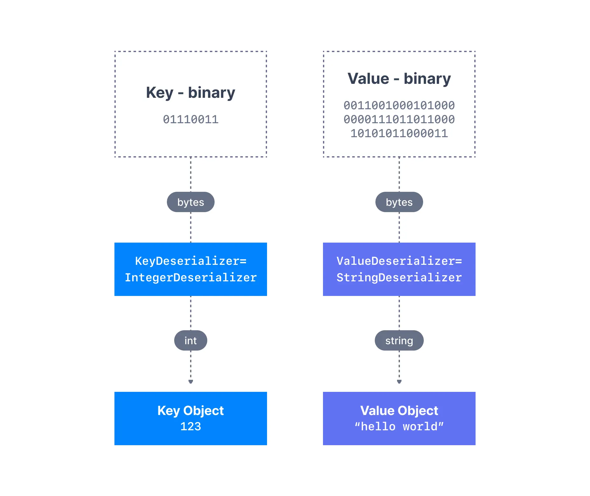

Kafka Consumers
===============

What is a Kafka consumer and what are message deserializers?

* * *

Once a topic has been created in Kafka and data has been placed in the topic, we can start to build applications that make use of this data stream. Applications that pull event data from one or more Kafka topics are known as Kafka Consumers.

* * *

Kafka Consumers
---------------

Applications that read data from Kafka topics are known as consumers. Applications integrate a Kafka client library to read from Apache Kafka. Excellent client libraries exist for almost [all programming languages](https://github.com/AbdoMusk/Apache-Kafka/blob/main/4-%20Kafka%20Programming%20Tutorials/Kafka%20SDK%20List.md) that are popular today including Python, Java, Go, and others.

Consumers can read from one or more partitions at a time in Apache Kafka, and data is read in order **within each partition** as shown below.

Kafka Consumers

A consumer always reads data from a lower offset to a higher offset and cannot read data backwards (due to how Apache Kafka and clients are implemented).

If the consumer consumes data from more than one partition, the message order is not guaranteed across multiple partitions because they are consumed simultaneously, but the message read order is still guaranteed within each individual partition.

By default, Kafka consumers will only consume data that was produced after it first connected to Kafka. Which means that to read historical data in Kafka, one must specify it as an input to the command, as we will see in the practice section.

Kafka consumers are also known to implement a "pull model". This means that Kafka consumers must request data from Kafka brokers in order to get it (instead of having Kafka brokers continuously push data to consumers). This implementation was made so that consumers can control the speed at which the topics are being consumed.

* * *

Kafka Message Deserializers
---------------------------

> [!TIP]
> **Serialization & Deserialization**
>
> Data being consumed must be deserialized in the same format it was serialized in.

As we have seen before, the data sent by the Kafka producers is [serialized](https://github.com/AbdoMusk/Apache-Kafka/blob/main/1-%20Kafka%20Fundamentals/3-%20Kafka%20Producers.md). This means that the data received by the Kafka consumers must be correctly deserialized in order to be useful within your application. Data being consumed must be deserialized in the same format it was serialized in. For example:

*   if the producer serialized a `String` using `StringSerializer`, the consumer must deserialize it using `StringDeserializer`
    
*   if the producer serialized an `Integer` using `IntegerSerializer`, the consumer must deserialize it using `IntegerDeserializer`
    

Deserialization

The serialization and deserialization format of a topic must not change during a topic lifecycle. If you intend to switch a topic data format (for example from JSON to Avro), it is considered best practice to create a new topic and migrate your applications to leverage that new topic.

> [!TIP]
> **Poison Pills**
>
> Messages sent to a Kafka topic that do not respect the agreed-upon serialization format are called poison pills. [They are not fun to deal with.](https://www.slideshare.net/ConfluentInc/streaming-apps-and-poison-pills-handle-the-unexpected-with-kafka-streams-loic-divad-xebia-france-kafka-summit-sf-2019)

Failure to correctly deserialize may cause crashes or inconsistent data being fed to the downstream processing applications. This can be tough to debug, so it is best to think about it as you're writing your code the first time.

---
Next: [Kafka Consumer Groups & Offsets](https://github.com/AbdoMusk/Apache-Kafka/blob/main/1-%20Kafka%20Fundamentals/4-%20Kafka%20Consumer%20Groups%20%26%20Offsets.md)