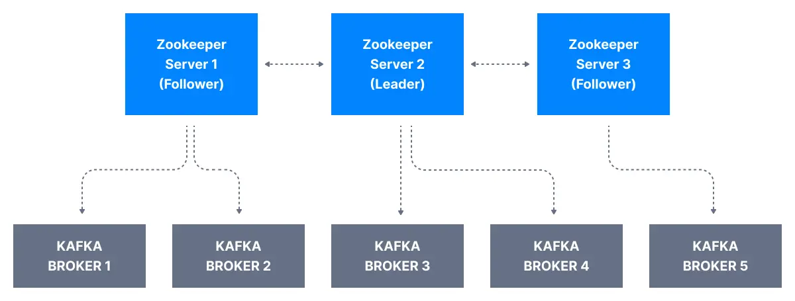

Zookeeper with Kafka
====================

What is the role of Zookeeper in a Kafka cluster?

* * *

> [!TIP]
> **What is Zookeeper in Kafka?**
>
> Zookeeper is used to track cluster state, membership, and leadership

> [!TIP]
> **Zookeeper Being Eliminated from Kafka v4.x**
>
> **Important**:
>
> 1.  Kafka 0.x, 1.x & 2.x must use Zookeeper
>     
> 2.  Kafka 3.x can work without Zookeeper (KIP-500) but is not production ready yet
>     
> 3.  Kafka 4.x will not have Zookeeper

What is Zookeeper in Kafka and what does Zookeeper do?
------------------------------------------------------

How do the Kafka brokers and clients keep track of all the Kafka brokers if there is more than one? The Kafka team decided to use Zookeeper for this purpose.

Zookeeper is used for metadata management in the Kafka world. For example:

*   Zookeeper keeps track of which brokers are part of the Kafka cluster
    
*   Zookeeper is used by Kafka brokers to determine which broker is the leader of a given partition and topic and perform leader elections
    
*   Zookeeper stores configurations for topics and permissions
    
*   Zookeeper sends notifications to Kafka in case of changes (e.g. new topic, broker dies, broker comes up, delete topics, etc.…)
    

> [!TIP]
> **ZConsumer Offsets**
>
> Zookeeper does NOT store consumer offsets with Kafka clients >= v0.10

A Zookeeper cluster is called an _ensemble_. It is recommended to operate the ensemble with an odd number of servers, e.g., 3, 5, 7, as a strict majority of ensemble members (a quorum) must be working in order for Zookeeper to respond to requests. Zookeeper has a leader to handle writes, the rest of the servers are followers to handle reads.

Zookeeper in Kafka

Should you use Zookeeper with Kafka brokers?
--------------------------------------------

As long as Kafka without Zookeeper is not production ready, you must use Zookeeper in your production deployments for Apache Kafka.

Should you use Zookeeper with Kafka clients?
--------------------------------------------

Over time, the Kafka clients and CLI have been migrated to leverage the brokers as a connection endpoint instead of Zookeeper.

This means that:

*   since Kafka 0.10, consumers store offset in Kafka and Zookeeper and must not connect to Zookeeper as the option is deprecated
    
*   since Kafka 2.2, the `kafka-topics.sh` CLI command references Kafka brokers and not Zookeeper for topic management (creation, deletion, etc...) and the Zookeeper CLI argument is deprecated.
    
*   All of the APIs and commands that were previously leveraging Zookeeper are migrated to use Kafka instead, so that when clusters are migrated to be without Zookeeper, the change is invisible to clients.
    
*   Zookeeper is also less secure than Kafka, and therefore Zookeeper ports should only be opened to allow traffic from Kafka brokers, and not Kafka clients
    

**Therefore, to be a great modern-day Kafka developer, never ever use Zookeeper as a configuration in your Kafka clients, and other programs that connect to Kafka.**

---
Next: [Kafka KRaft Mode](https://github.com/AbdoMusk/Apache-Kafka/blob/main/1-%20Kafka%20Fundamentals/8-%20Kafka%20KRaft%20Mode.md)