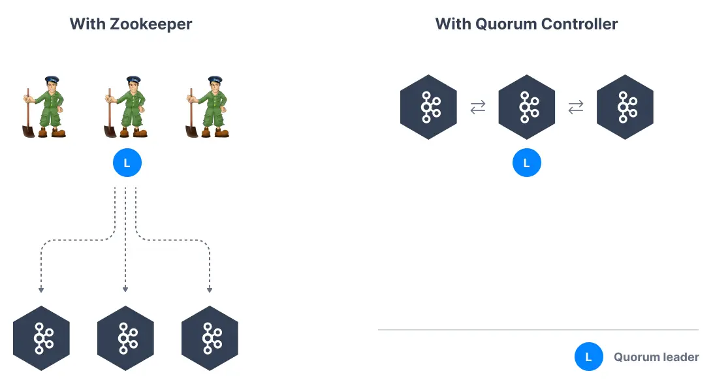

Kafka KRaft Mode
================

Apache Kafka without Zookeeper

* * *

The Kafka project undertook one of its greatest change with the introduction of [KIP-500](https://cwiki.apache.org/confluence/display/KAFKA/KIP-500%3A+Replace+ZooKeeper+with+a+Self-Managed+Metadata+Quorum) on August 1st 2019: the desire to remove Zookeeper as a dependency to running Apache Kafka.

Why remove Zookeeper from Kafka?
--------------------------------

Kafka scaling has hit a performance bottleneck with Zookeeper, which means Kafka has the following limitations with Zookeeper:

*   Kafka clusters only support a limited number of partitions (up to 200,000)
    
*   When a Kafka broker joins or leaves a cluster, a high number of leader election must happen which can overload Zookeeper and slow down the cluster temporarily
    
*   Kafka clusters setup is difficult and depends on another component to setup
    
*   Kafka cluster metadata is sometimes out-of-sync from Zookeeper
    
*   Zookeeper security is lagging behind Kafka security
    

Kafka KRaft Mode
----------------

It has been noted as part of KIP-500 that the metadata of Kafka itself is a log and that Kafka brokers should be able to consume that metadata log as an internal metadata topic. Kafka leverages itself!

Removing Zookeeper means that Kafka must still act as a quorum to perform controller election and therefore the Kafka brokers implement the [Raft protocol](https://cwiki.apache.org/confluence/display/KAFKA/KIP-595%3A+A+Raft+Protocol+for+the+Metadata+Quorum) thus giving the name KRaft to the new Kafka Metadata Quorum mode.

Without Zookeeper, the following benefits are observed in Kafka:

*   Ability to scale to millions of partitions, easier to maintain and set up
    
*   Improved stability, easier to monitor, support, and administer
    
*   Single process to start Kafka
    
*   Single security model for the whole system
    
*   Faster controller shutdown and recovery time
    

More Kafka KRaft reading
------------------------

Kafka KRaft was officially released as of Kafka version 3.3 and is now production ready. Read more on the [change here](https://cwiki.apache.org/confluence/display/KAFKA/KIP-833%3A+Mark+KRaft+as+Production+Ready).

A starting tutorial is included on this site for [Windows](https://github.com/AbdoMusk/Apache-Kafka/blob/main/2-%20Starting%20Kafka/7-%20How%20to%20Install%20Apache%20Kafka%20on%20Windows.md), [Mac](https://github.com/AbdoMusk/Apache-Kafka/blob/main/2-%20Starting%20Kafka/2-%20How%20to%20Install%20Apache%20Kafka%20on%20Mac.md) and [Linux](https://github.com/AbdoMusk/Apache-Kafka/blob/main/2-%20Starting%20Kafka/5-%20How%20to%20Install%20Apache%20Kafka%20on%20Linux.md).

A good blog on the [Confluent blog](https://www.confluent.io/blog/kafka-without-zookeeper-a-sneak-peek/) describes the benefits of KRaft.

---
Next: [Starting Kafka](https://github.com/AbdoMusk/Apache-Kafka/tree/main/2-%20Starting%20Kafka)