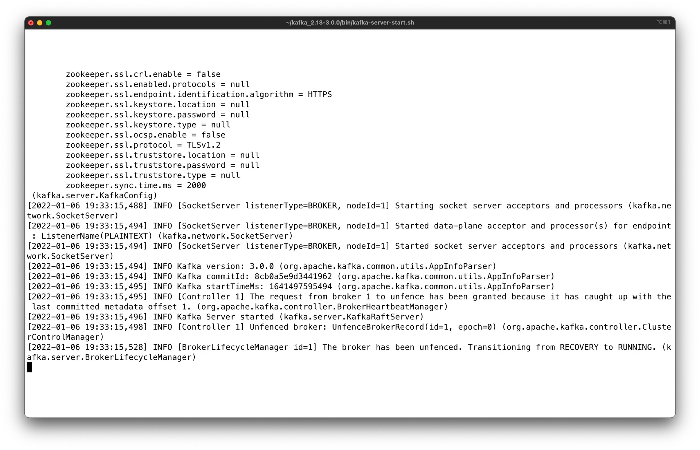

How to Install Apache Kafka on Mac without Zookeeper? (KRaft mode)
==================================================================

Start and run Apache Kafka on Mac OS X without Zookeeper.

* * *

Install Kafka with KRaft (without Zookeeper) on Mac OS X
--------------------------------------------------------

[](#Install-Kafka-with-KRaft-(without-Zookeeper)-on-Mac-OS-X-0)

1.  Install Java JDK version 11
    
2.  Download Apache Kafka from [https://kafka.apache.org/downloads](https://kafka.apache.org/downloads) under 'Binary Downloads'
    
3.  Extract the contents on your Mac
    
4.  Generate a cluster ID and format the storage using `kafka-storage.sh`
    
5.  Start Kafka using the binaries
    
6.  Setup the $PATH environment variables for easy access to the Kafka binaries
    

### Installing Java JDK 11

[](#Installing-Java-JDK-11-0)

To install Apache Kafka on Mac, Java 11 is the only prerequisite.

*   Navigate to [Amazon Corretto 11 download page](https://docs.aws.amazon.com/corretto/latest/corretto-11-ug/downloads-list.html) (the Amazon distribution of OpenJDK 11) install [amazon-corretto-11-x64-macos-jdk.pkg](https://corretto.aws/downloads/latest/amazon-corretto-11-x64-macos-jdk.pkg)
    
*   Double click on the downloaded file and proceed with the installation steps.
    
*   You have successfully installed Java JDK 11. You may delete the .pkg file.
    


Please follow the instructions [here](https://docs.aws.amazon.com/corretto/latest/corretto-11-ug/macos-install.html#macos-install-instruct) to verify your installation of Amazon Corretto 11. Instructions on how to set the default version of Java on a Mac can be found [here](https://stackoverflow.com/a/24657630).

[](javascript:void(0);)

```
openjdk version "11.0.10" 2021-01-19 LTS
OpenJDK Runtime Environment Corretto-11.0.10.9.1 (build 11.0.10+9-LTS)
OpenJDK 64-Bit Server VM Corretto-11.0.10.9.1 (build 11.0.10+9-LTS, mixed mode)shell
```

### Install Apache Kafka

[](#Install-Apache-Kafka-1)

Download the latest version of Apache Kafka from [https://kafka.apache.org/downloads](https://kafka.apache.org/downloads) under Binary downloads.


2\. Click on any of the binary downloads (it is preferred to choose the most recent Scala version - example 2.13). For this illustration, we will assume version `2.13-2.8.1`.

3\. Download and extract the contents (double click in the Finder) to a directory of your choice, for example `~/kafka_2.13-2.8.1` .

4\. Navigate to the root of the Apache Kafka folder and open a Terminal. Or Open a Terminal and navigate to the root directory of Apache Kafka. For this example, we will assume that the Kafka download is expanded into the `~/kafka_2.13-2.8.1` directory.

### Start Kafka

[](#Start-Kafka-2)

The first step is to generate a new ID for your cluster

```
~/kafka_2.13-2.8.1/bin/kafka-storage.sh random-uuid
```

This returns a UUID, for example `76BLQI7sT_ql1mBfKsOk9Q`

Next, format your storage directory (replace <uuid> by your UUID obtained above)

```
~/kafka_2.13-2.8.1/bin/kafka-storage.sh format -t <uuid> -c ~/kafka_2.13-2.8.1/config/kraft/server.properties
```

This will format the directory that is in the `log.dirs` in the `config/kraft/server.properties` file (by default `/tmp/kraft-combined-logs`)

Now you can launch the broker itself in daemon mode by running this command.

```
~/kafka_2.13-2.8.1/bin/kafka-server-start.sh ~/kafka_2.13-2.8.1/config/kraft/server.properties
```



Don’t close this terminal window as it will shutdown the broker.

**Congratulations, the broker is now running on its own in KRaft mode!**

### Setup the $PATH environment variable

[](#Setup-the-$PATH-environment-variable-3)

In order to easily access the Kafka binaries, you can edit your PATH variable by adding the following line (edit the content to your system) to your system run commands (for example `~/.zshrc` if you use zshrc):

`PATH="$PATH:/Users/stephanemaarek/kafka_2.13-2.8.1/bin"`

This ensures that you can now run the kafka commands without prefixing them.

After reloading your terminal, the following should work from any directory

```
kafka-topics.sh
```

### Read more

[](#Read-more-4)

You can read and learn more about the KRaft mode in Kafka [here](https://github.com/apache/kafka/blob/trunk/config/kraft/README.md).

---
Next: [How to install Apache Kafka on Mac with Homebrew](https://github.com/AbdoMusk/Apache-Kafka/blob/main/2-%20Starting%20Kafka/4-%20How%20to%20install%20Apache%20Kafka%20on%20Mac%20with%20Homebrew.md)