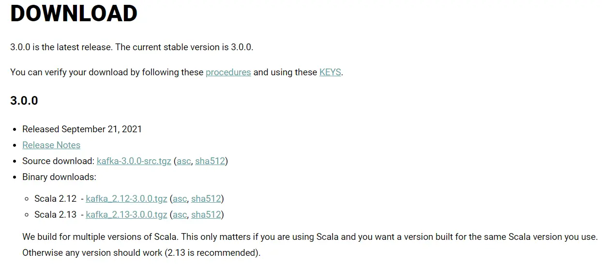
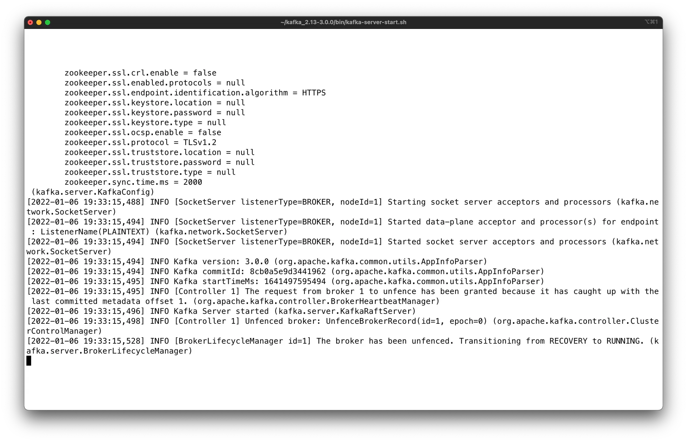

How to Install Apache Kafka on Linux without Zookeeper? (KRaft mode)
====================================================================

Start and run Apache Kafka on Linux without Zookeeper.

* * *

Kafka with KRaft (without Zookeeper) on Linux
---------------------------------------------

[](#Kafka-with-KRaft-(without-Zookeeper)-on-Linux-0)

1.  Install Java JDK version 11
    
2.  Download Apache Kafka v2.8+ from [https://kafka.apache.org/downloads](https://kafka.apache.org/downloads) under Binary
    
3.  Downloads
    
4.  Extract the contents on Linux
    
5.  Generate a cluster ID and format the storage using kafka-storage.sh
    
6.  Start Kafka using the binaries
    
7.  Setup the $PATH environment variables for easy access to the Kafka binaries
    

Installing Java JDK 11
----------------------

[](#Installing-Java-JDK-11-1)

To install Apache Kafka on Linux, Java 11 is the only prerequisite.

1.  Navigate to [Amazon Corretto 11 Linux install page](https://docs.aws.amazon.com/corretto/latest/corretto-11-ug/linux-info.html) and follow the steps, which work for Debian, RPM, Alpine and Amazon Linux. Alternatively, you can download from the [Amazon Corretto 11 download page](https://docs.aws.amazon.com/corretto/latest/corretto-11-ug/downloads-list.html) and install the correct package for your Linux distribution (x64, aarch64, x86, arch32, etc...).
    
2.  For example on Ubuntu (Debian-based systems)
    

```
wget -O- https://apt.corretto.aws/corretto.key | sudo apt-key add -
sudo add-apt-repository 'deb https://apt.corretto.aws stable main'
sudo apt-get update; sudo apt-get install -y java-11-amazon-corretto-jdk
```

Please follow the instructions [here](https://docs.aws.amazon.com/corretto/latest/corretto-11-ug/generic-linux-install.html) to verify your installation of Amazon Corretto 11 and set the JDK as your default Java in your Linux system.

Upon completion, you should get a similar output when doing `java -version`:

```
openjdk version "11.0.10" 2021-01-19 LTS
OpenJDK Runtime Environment Corretto-11.0.10.9.1 (build 11.0.10+9-LTS)
OpenJDK 64-Bit Server VM Corretto-11.0.10.9.1 (build 11.0.10+9-LTS, mixed mode)shell
```

Install Apache Kafka
--------------------

[](#Install-Apache-Kafka-2)

1\. Download the latest version of Apache Kafka from [https://kafka.apache.org/downloads](https://kafka.apache.org/downloads) under Binary downloads.



2\. Click on any of the binary downloads (it is preferred to choose the most recent Scala version - example 2.13). For this illustration, we will assume version `2.13-2.8.1`.

Alternatively you can run a wget command

```
wget https://archive.apache.org/dist/kafka/2.8.1/kafka_2.13-2.8.1.tgz
```

3\. Download and extract the contents to a directory of your choice, for example `~/kafka_2.13-2.8.1` .

```
tar xzf kafka_2.12-3.0.0.tgz
mv kafka_2.12-3.0.0 ~
```

4\. Open a Shell and navigate to the root directory of Apache Kafka. For this example, we will assume that the Kafka download is expanded into the `~/kafka_2.13-2.8.1` directory.

Start Kafka
-----------

[](#Start-Kafka-3)

The first step is to generate a new ID for your cluster

```
~/kafka_2.13-2.8.1/bin/kafka-storage.sh random-uuid
```

This returns a UUID, for example `76BLQI7sT_ql1mBfKsOk9Q`

Next, format your storage directory (replace <uuid> by your UUID obtained above)

```
~/kafka_2.13-2.8.1/bin/kafka-storage.sh format -t <uuid> -c ~/kafka_2.13-2.8.1/config/kraft/server.properties
```

This will format the directory that is in the `log.dirs` in the `config/kraft/server.properties` file (by default `/tmp/kraft-combined-logs`)

Now you can launch the broker itself in daemon mode by running this command.

```
~/kafka_2.13-2.8.1/bin/kafka-server-start.sh ~/kafka_2.13-2.8.1/config/kraft/server.properties
```



Don’t close this shell window as it will shutdown the broker.

**Congratulations, the broker is now running on its own in KRaft mode!**

Setup the $PATH environment variable
------------------------------------

[](#Setup-the-$PATH-environment-variable-4)

In order to easily access the Kafka binaries, you can edit your PATH variable by adding the following line to your system run commands (for example `~/.zshrc` if you use zshrc):

`PATH="$PATH:~/kafka_2.13-2.8.1/bin"`

This ensures that you can now run the kafka commands without prefixing them.

After reloading your shell, the following should work from any directory


```
kafka-topics.sh
```

Read more about Kafka KRaft
---------------------------

[](#Read-more-about-Kafka-KRaft-5)

You can read and learn more about the KRaft mode in Kafka [here](https://github.com/apache/kafka/blob/trunk/config/kraft/README.md).

---
Next: [How to Install Apache Kafka on Windows](https://github.com/AbdoMusk/Apache-Kafka/blob/main/2-%20Starting%20Kafka/7-%20How%20to%20Install%20Apache%20Kafka%20on%20Windows.md)