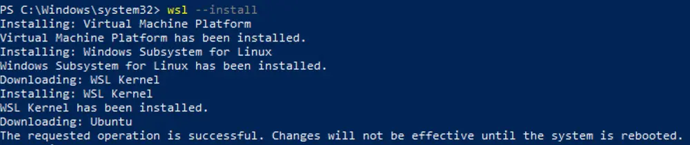
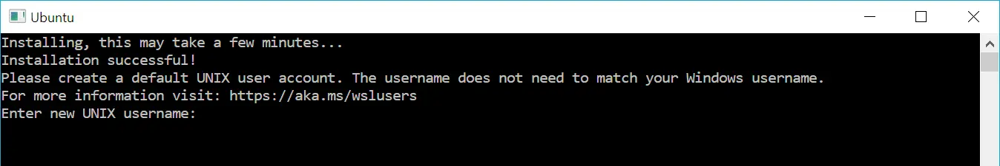
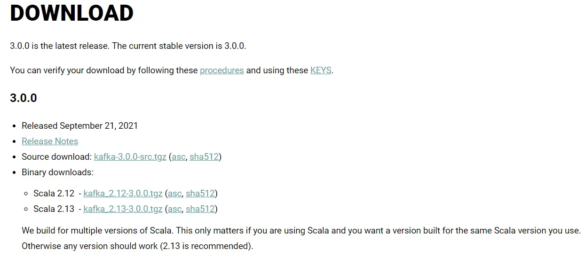
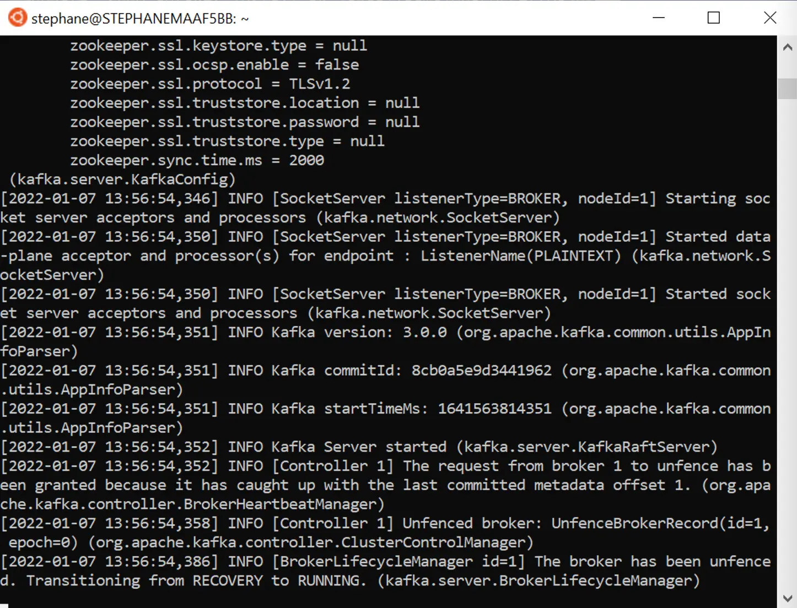

How to Install Apache Kafka on Windows without Zookeeper (KRaft mode)
=====================================================================

Start and run Apache Kafka on Windows without Zookeeper.

* * *

MUST READ
---------

[](#MUST-READ-0)

> [!CAUTION]
> **Windows Issues**
>
> Kafka is not intended to be run on Windows natively and has several issues that may arise over time.

For maximum compatibility, it is recommended to run Apache Kafka on Windows through:

*   If using Windows 10 or above: WSL2 (see below) or [Docker](/kafka/how-to-start-kafka-using-docker/)
    
*   If using Windows 8 or below: [Docker](/kafka/how-to-start-kafka-using-docker/)
    

It is not recommended to run Kafka on the JVM on Windows, because it lacks some of the linux-specific features of POSIX for example. You will run into issues at some point if you try to run Kafka on Windows without WSL2.

* * *

Kafka with KRaft (without Zookeeper) on Windows
-----------------------------------------------

[](#Kafka-with-KRaft-(without-Zookeeper)-on-Windows-1)

1.  You must have Windows 10 or above
    
2.  Install WSL2
    
3.  Install Java JDK version 11
    
4.  Download Apache Kafka from [https://kafka.apache.org/downloads](https://kafka.apache.org/downloads) under Binary
    
5.  Downloads
    
6.  Extract the contents on WSL2
    
7.  Generate a cluster ID and format the storage using `kafka-storage.sh`
    
8.  Start Kafka using the binaries in another process in WSL2
    
9.  Setup the $PATH environment variables for easy access to the Kafka binaries
    

Installing WSL2
---------------

[](#Installing-WSL2-2)

WSL2 is Windows Subsystem for Linux 2 and provides a Linux environment for your Windows computer that does not require a virtual machine

You can use most Linux commands on WSL2 which makes your Kafka installation experience closer to the guides provided for Linux & Mac.

> [!TIP]
> **Installing WSL2**
>
> To install WSL2, make sure you're on Windows 10 version 2004 and higher (Build 19041 and higher) or Windows 11 To check your Windows version do Windows logo key + R, type winver, select OK

Steps to install WSL2 on Windows are described on the [Microsoft Docs](https://docs.microsoft.com/en-us/windows/wsl/install) website: You can now install everything you need to run Windows Subsystem for Linux (WSL) by entering this command in an administrator PowerShell or Windows Command Prompt and then restarting your machine.

```
wsl --install
```

This command will enable the required optional components, download the latest Linux kernel, set WSL 2 as your default, and install a Linux distribution for you _(Ubuntu by default, see below to change this)_.



> [!TIP]
> **Troubleshooting Kafka on Windows**
>
> For troubleshooting common issues, [here is a very helpful article from Microsoft](https://docs.microsoft.com/en-us/windows/wsl/troubleshooting).

The first time you launch a newly installed Linux distribution, a console window will open and you'll be asked to wait for files to de-compress and be stored on your machine. All future launches should take less than a second.

Set up your Linux username and password
---------------------------------------

[](#Set-up-your-Linux-username-and-password-3)

Once the process of installing your Linux distribution with WSL is complete, open the distribution (Ubuntu by default) using the Start menu. You will be asked to create a **User Name** and **Password** for your Linux distribution.



1.  This **User Name** and **Password** is specific to each separate Linux distribution that you install and has no bearing on your Windows user name.
    
2.  Once you create a **User Name** and **Password**, the account will be your default user for the distribution and automatically sign-in on launch.
    
3.  This account will be considered the Linux administrator, with the ability to run `sudo` (Super User Do) administrative commands.
    

Disable IPv6 on WSL2
--------------------

[](#Disable-IPv6-on-WSL2-4)

WSL2 [currently has a networking issue](https://github.com/microsoft/WSL/issues/4851) that prevents outside programs to connect to Kafka running on WSL2 (for example your Java programs, Conduktor, etc...);

To fix this, we recommend disabling IPv6 on WSL2. Your Windows password will be prompted on the first command:

```
sudo sysctl -w net.ipv6.conf.all.disable_ipv6=1
sudo sysctl -w net.ipv6.conf.default.disable_ipv6=1
```

Installing Java JDK 11
----------------------

[](#Installing-Java-JDK-11-5)

To install Apache Kafka on WSL2 Ubuntu, Java 11 is the only prerequisite.

1.  Navigate to [Amazon Corretto 11 Linux install page](https://docs.aws.amazon.com/corretto/latest/corretto-11-ug/linux-info.html) and follow the steps
    
2.  For example on Ubuntu (Debian-based systems)
    

```
wget -O- https://apt.corretto.aws/corretto.key | sudo apt-key add -
sudo add-apt-repository 'deb https://apt.corretto.aws stable main' 
sudo apt-get update; sudo apt-get install -y java-11-amazon-corretto-jdk
```

3\. Upon completion, you should get a similar output when doing `java -version`:

[](javascript:void(0);)

```
openjdk version "11.0.10" 2021-01-19 LTS
OpenJDK Runtime Environment Corretto-11.0.10.9.1 (build 11.0.10+9-LTS)
OpenJDK 64-Bit Server VM Corretto-11.0.10.9.1 (build 11.0.10+9-LTS, mixed mode)shell
```

Install Apache Kafka
--------------------

[](#Install-Apache-Kafka-6)

1\. Download the latest version of Apache Kafka from [https://kafka.apache.org/downloads](https://kafka.apache.org/downloads) under Binary downloads.



2\. Click on any of the binary downloads (it is preferred to choose the most recent Scala version - example 2.13). For this illustration, we will assume version `2.13-2.8.1`.

Alternatively you can run a wget command

```
wget https://archive.apache.org/dist/kafka/2.8.1/kafka_2.13-2.8.1.tgz
```

3\. Download and extract the contents to a directory of your choice, for example `~/kafka_2.13-2.8.1` .

```
tar xzf kafka_2.13-2.8.1.tgz
mv kafka_2.13-2.8.1 ~
```

4\. Open a Shell and navigate to the root directory of Apache Kafka. For this example, we will assume that the Kafka download is expanded into the `~/kafka_2.13-2.8.1` directory.

Start Kafka
-----------

[](#Start-Kafka-7)

**Open another Shell window**

The first step is to generate a new ID for your cluster

```
~/kafka_2.13-2.8.1/bin/kafka-storage.sh random-uuid
```

This returns a UUID, for example `76BLQI7sT_ql1mBfKsOk9Q`

Next, format your storage directory (replace <uuid> by your UUID obtained above)

```
~/kafka_2.13-2.8.1/bin/kafka-storage.sh format -t <uuid> -c ~/kafka_2.13-2.8.1/config/kraft/server.properties
```

This will format the directory that is in the `log.dirs` in the `config/kraft/server.properties` file (by default `/tmp/kraft-combined-logs`)

Now you can launch the broker itself in daemon mode by running this command.

```
~/kafka_2.13-2.8.1/bin/kafka-server-start.sh ~/kafka_2.13-2.8.1/config/kraft/server.properties
```



Don’t close this shell window as it will shutdown the broker.

**Congratulations, the broker is now running on its own in KRaft mode!**

Setup the $PATH environment variable
------------------------------------

[](#Setup-the-$PATH-environment-variable-8)

In order to easily access the Kafka binaries, you can edit your PATH variable by adding the following line to your system run commands to`~/.bashrc` :

`PATH="$PATH:~/kafka_2.13-2.8.1/bin"`

This ensures that you can now run the kafka commands without prefixing them.

After reloading your shell, the following should work from any directory

```
kafka-topics.sh
```

### Read more about Apache Kafka KRaft

[](#Read-more-about-Apache-Kafka-KRaft-0)

You can read and learn more about the KRaft mode in Kafka [here](https://github.com/apache/kafka/blob/trunk/config/kraft/README.md).

---
Next: [How to Start Kafka using Docker](https://github.com/AbdoMusk/Apache-Kafka/blob/main/2-%20Starting%20Kafka/9-%20How%20to%20Start%20Kafka%20using%20Docker.md)