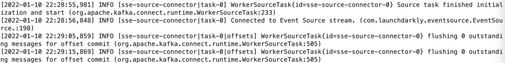
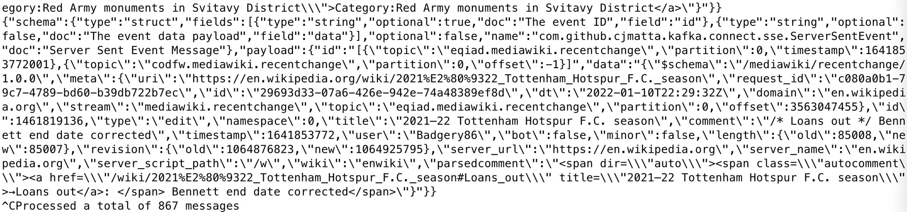

Kafka Connect CLI Tutorial
==========================

Learn how to use Kafka Connect in standalone mode to write data into Apache Kafka.

* * *

Kafka Connect deserves its own section to be learned in-depth, but in this tutorial, we will learn how to leverage Kafka Connect connectors with `connect-standalone` to write data into Kafka.

In this tutorial, we will stream the changes of Wikipedia into a Kafka topic.

[You can see the stream changes in Wikipedia here](https://stream.wikimedia.org/v2/stream/recentchange)

* * *

What is Kafka Connect?
----------------------

[](#What-is-Kafka-Connect?-0)

In order to get data into Apache Kafka, we have seen that we need to leverage Kafka producers. Over time, it has been noticed that many companies shared the same data source types (databases, systems, etc...) and so writing open-source standardized code could be helpful for the greater good. The same thinking goes for Kafka Consumers.

Kafka Connect is a tool that allows us to integrate popular systems with Kafka. It allows us to re-use existing components to source data into Kafka and sink data out from Kafka into other data stores.

Example of popular Kafka Connectors include:

*   **Kafka Connect Source Connectors (producers)**: Databases (through the Debezium connector), JDBC, Couchbase, GoldenGate, SAP HANA, Blockchain, Cassandra, DynamoDB, FTP, IOT, MongoDB, MQTT, RethinkDB, Salesforce, Solr, SQS, Twitter, etc…
    
*   **Kafka Connect Sink Connectors (consumers):** S3, ElasticSearch, HDFS, JDBC, SAP HANA, DocumentDB, Cassandra, DynamoDB, HBase, MongoDB, Redis, Solr, Splunk, Twitter
    

* * *

How to use Kafka Connect in Standalone mode?
--------------------------------------------

[](#How-to-use-Kafka-Connect-in-Standalone-mode?-1)

To use Kafka Connect in standalone mode, we need to provide the mandatory parameters:

*   Download a Kafka Connect connector, either from GitHub or Confluent Hub [Confluent Hub](https://www.confluent.io/hub/)
    
*   Create a configuration file for your connector
    
*   Use the `connect-standalone.sh` CLI to start the connector
    

### Example: Kafka Connect Standalone with Wikipedia data

[](#Example:-Kafka-Connect-Standalone-with-Wikipedia-data-0)

Create the Kafka topic `wikipedia.recentchange` in Kafka with 3 partitions

```
kafka-topics --bootstrap-server localhost:9092 --topic wikipedia.recentchange --create --partitions 3 --replication-factor 1
```

As well as the topic dead letter queue `wikipedia.dlq`, for catching any errors

```
kafka-topics --bootstrap-server localhost:9092 --topic wikipedia.dlq --create --partitions 3 --replication-factor 1
```

Download the release JAR and configuration from [here](https://github.com/simplesteph/kafka-connect-sse/releases/download/v1.0/kafka-connect-sse.zip) and unzip the archive on your computer at `kafka_2.13-2.8.1/connectors/kafka-connect-sse`:

```
 ~/kafka_2.13-2.8.1/connectors  ls -R
kafka-connect-sse

./kafka-connect-sse:
connector.properties                            kafka-connect-sse-1.0-jar-with-dependencies.jar
```

Edit the configuration file `connectors/kafka-connect-sse/connector.properties` with the following properties:

```
name=sse-source-connector
tasks.max=1
connector.class=com.github.cjmatta.kafka.connect.sse.ServerSentEventsSourceConnector
topic=wikipedia.recentchange
sse.uri=https://stream.wikimedia.org/v2/stream/recentchange
errors.tollerance=all
errors.deadletterqueue.topic.name=wikipedia.dlq
```

Look into your Kafka installation directory (where your `bin` and `config` folders are)

Edit the content of the `config/connect-standalone.properties` file

```
key.converter=org.apache.kafka.connect.json.JsonConverter
value.converter=org.apache.kafka.connect.json.JsonConverter
key.converter.schemas.enable=true
value.converter.schemas.enable=true
offset.flush.interval.ms=10000

# EDIT BELOW IF NEEDED
bootstrap.servers=localhost:9092
offset.storage.file.filename=/tmp/connect.offsets
plugin.path=/Users/stephanemaarek/kafka_2.13-2.8.1/connectors
```

The last three lines are the most important to make everything work.

In particular, the `plugin.path` config: this is where you indicate the folder where you store your Kafka connectors you have downloaded before.

**This must be an absolute path (not relative, and no shortcut with** **`~`****) to your** **`connectors`** **directory**

If you fail this step, Kafka Connect will stop after starting it.

Next, we can start our Kafka Connect Standalone connector

```
connect-standalone ~/kafka_2.13-2.8.1/config/connect-standalone.properties ~/kafka_2.13-2.8.1/connectors/kafka-connect-sse/connector.properties
```



And as we can see, the data is flowing into our `wikipedia.recentchange` topic:

```
kafka-console-consumer --bootstrap-server localhost:9092 --topic wikipedia.recentchange
```



There is a lot more to explore in Kafka Connect, this part was meant as an introduction.

Hope you liked it!