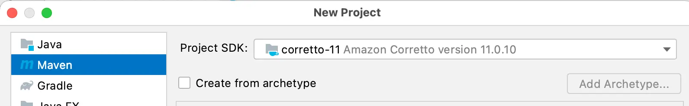
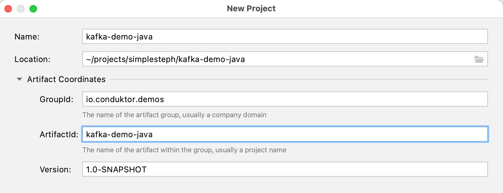
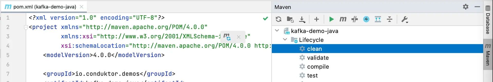
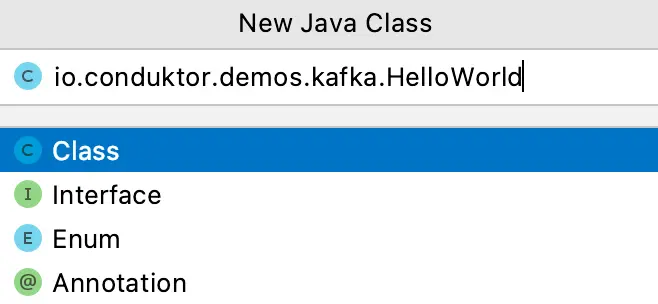
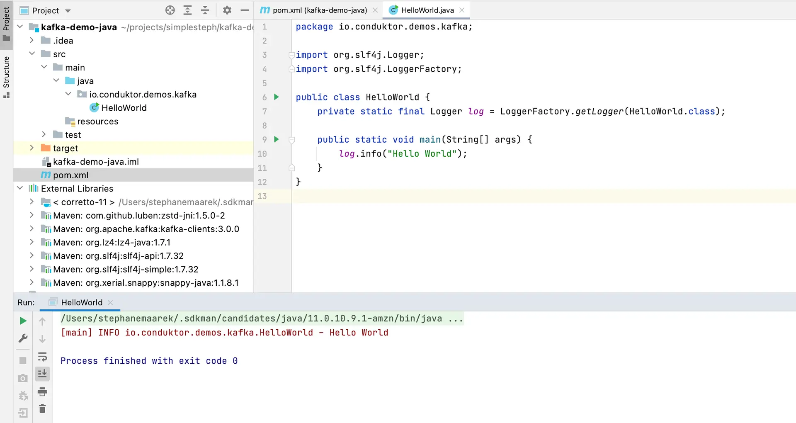

Creating a Kafka Java Project using Maven (pom.xml)
===================================================

Learn how to create a Java project using Maven that can interact with Kafka cluster

* * *

Maven is a popular choice for Kafka projects in Java.
-----------------------------------------------------

[](#Maven-is-a-popular-choice-for-Kafka-projects-in-Java.--0)

Before developing Kafka producers and consumers in Java, we'll have to set up a simple Kafka Java project that includes common dependencies that we'll need, namely:

*   Kafka dependencies
    
*   Logging dependencies
    

Follow these steps to create a Java project with the above dependencies.

* * *

Creating a Maven project with pom.xml and setting up dependencies
-----------------------------------------------------------------

[](#Creating-a-Maven-project-with-pom.xml-and-setting-up-dependencies-1)

In IntelliJ IDEA, create a new Java maven project (File > New > Project)



Then add your Maven project attributes



The build tool Maven contains a `**pom.xml**` file. The `pom.xml` is a default XML file that carries all the information regarding the GroupID, ArtifactID, as well as the Version values. The user needs to define all the necessary project dependencies in the `pom.xml` file. Go to the `pom.xml` file.

 Project XML File")

pom.xl

Define the Kafka Dependencies. Create a `**<dependencies>...</dependencies>**` block within which we will define the required dependencies.

Add a dependency for Kafka client as shown below

```
<project>
    ...

    <dependencies>
        <!-- https://mvnrepository.com/artifact/org.apache.kafka/kafka-clients -->
        <dependency>
            <groupId>org.apache.kafka</groupId>
            <artifactId>kafka-clients</artifactId>
            <version>2.8.1</version>
        </dependency>
    </dependencies>

</project>
```

If the version number appears red in color, it means the user missed to enable the '**Auto-Import**' option. If so, go to **View > Tool Windows > Maven**. A Maven Projects Window will appear on the right side of the screen. Click on the 'Refresh' button appearing right there. This will enable the missed Auto-Import Maven Projects. If the color changes to black, it means the missed dependency is downloaded.



Add another dependency for logging. This will enable us to print diagnostic logs while our application runs.

```
        <!-- https://mvnrepository.com/artifact/org.slf4j/slf4j-api -->
        <dependency>
            <groupId>org.slf4j</groupId>
            <artifactId>slf4j-api</artifactId>
            <version>1.7.32</version>
        </dependency>

        <!-- https://mvnrepository.com/artifact/org.slf4j/slf4j-simple -->
        <dependency>
            <groupId>org.slf4j</groupId>
            <artifactId>slf4j-simple</artifactId>
            <version>1.7.32</version>
        </dependency>
```

Now, we have set all the required dependencies. Let's try the _Simple Hello World_ example.

* * *

Creating your first class
-------------------------

[](#Creating-your-first-class-2)

Create a java package say, `io.conduktor.demos.kafka.HelloWorld`



While creating the java package, follow the package naming conventions. Finally, create the sample application program as shown below.

```
package io.conduktor.demos.kafka;

import org.slf4j.Logger;
import org.slf4j.LoggerFactory;

public class HelloWorld {
    private static final Logger log = LoggerFactory.getLogger(HelloWorld.class);

    public static void main(String[] args) {
        log.info("Hello World");
    }
}
```

Run the application (the play green button on line 9 in the screenshot below) and verify that it runs and prints the message, and exits with code `0`. This means that your Java application has run successfully.

Expand the 'External Libraries' on the Project panel and verify that it displays the dependencies that we added for the project in `pom.xml`.



All good!

We have created a sample Java project that includes all the needed dependencies. This will form the basis for creating Java producers and consumers next.

---
Next: [Creating a Kafka Java Project using Gradle (build.gradle)](https://github.com/AbdoMusk/Apache-Kafka/blob/main/4-%20Kafka%20Programming%20Tutorials/Java%20Kafka%20Programming/2-%20Creating%20a%20Kafka%20Java%20Project%20using%20Gradle%20%28build.gradle%29.md)