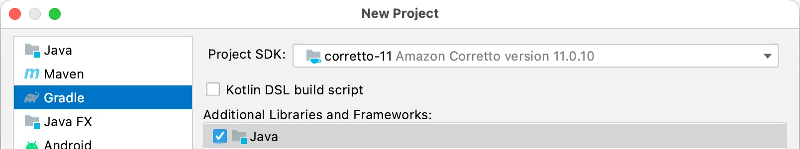
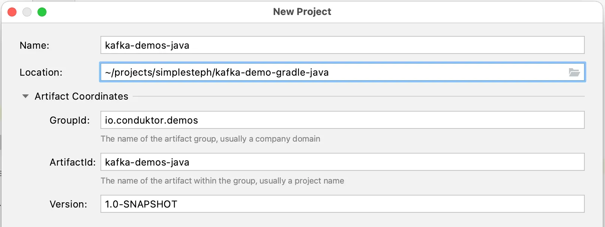
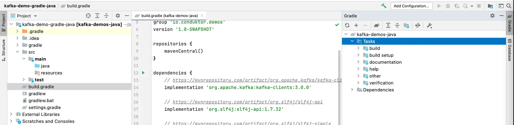
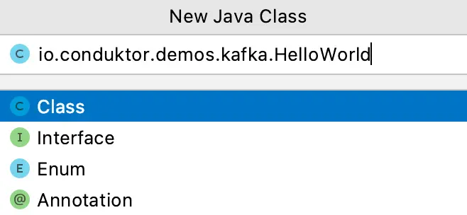

Creating a Kafka Java Project using Gradle (build.gradle)
=========================================================

Learn how to create a Java project using Gradle that can interact with Kafka cluster

* * *

Gradle is a popular choice for Kafka projects in Java.
------------------------------------------------------

[](#Gradle-is-a-popular-choice-for-Kafka-projects-in-Java.--0)

Before developing Kafka producers and consumers in Java, we'll have to set up a simple Kafka Java project that includes common dependencies that we'll need, namely:

*   Kafka dependencies
    
*   Logging dependencies
    

Follow these steps to create a Java project with the above dependencies.

* * *

Creating a Kafka Gradle project with build.gradle and setting up dependencies
-----------------------------------------------------------------------------

[](#Creating-a-Kafka-Gradle-project-with-build.gradle-and-setting-up-dependencies-1)

In IntelliJ IDEA, create a new Java Gradle project (File > New > Project)



Then add your Gradle project attributes



The build tool Gradle contains a `**build.gradle**` file. The `build.gradle` is a default Gradle file that carries all the information regarding the Group and Version values . The user needs to define all the necessary project dependencies in the `build.gradle` file. Go to the `build.gradle` file.

")

build.gradle

Define the Kafka Dependencies in the `dependencies { ... }` block.

Add a dependency for Kafka client and logging dependencies as shown below

```
dependencies {
    // https://mvnrepository.com/artifact/org.apache.kafka/kafka-clients
    implementation 'org.apache.kafka:kafka-clients:2.8.1'

    // https://mvnrepository.com/artifact/org.slf4j/slf4j-api
    implementation 'org.slf4j:slf4j-api:1.7.32'

    // https://mvnrepository.com/artifact/org.slf4j/slf4j-simple
    implementation 'org.slf4j:slf4j-simple:1.7.32'
    
    testImplementation 'org.junit.jupiter:junit-jupiter-api:5.6.0'
    testRuntimeOnly 'org.junit.jupiter:junit-jupiter-engine'
}
```

Load the Gradle changes with the menu from the right hand side to import the dependencies



Now, we have set all the required dependencies. Let's try the _Simple Hello World_ example.

* * *

Creating your first class
-------------------------

[](#Creating-your-first-class-2)

Create a java package say, `io.conduktor.demos.kafka.HelloWorld`



While creating the java package, follow the package naming conventions. Finally, create the sample application program as shown below.

```
package io.conduktor.demos.kafka;

import org.slf4j.Logger;
import org.slf4j.LoggerFactory;

public class HelloWorld {
    private static final Logger log = LoggerFactory.getLogger(HelloWorld.class);

    public static void main(String[] args) {
        log.info("Hello World");
    }
}
```

Run the application (the play green button on line 9 in the screenshot below) and verify that it runs and prints the message, and exits with code `0`. This means that your Java application has run successfully.

Expand the 'External Libraries' on the Project panel and verify that it displays the dependencies that we added for the project in `build.gradle` file

 Java Project Success")

We have created a sample Java project that includes all the needed dependencies. This will form the basis for creating Java producers and consumers next.