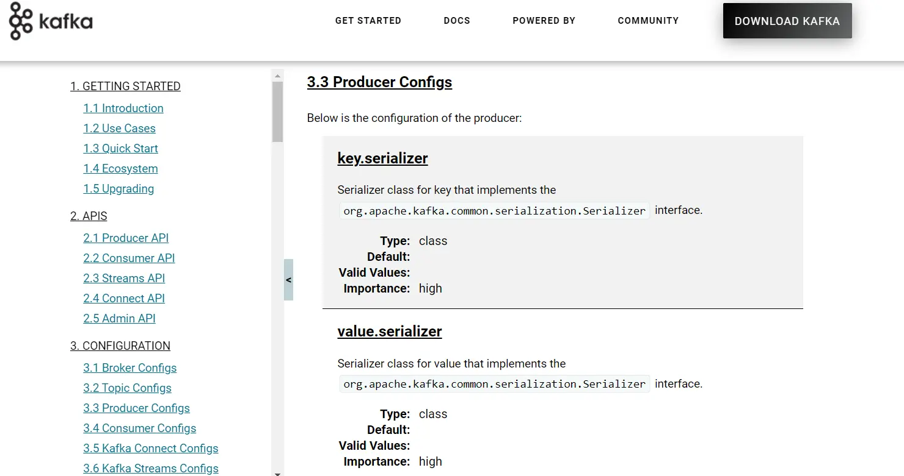

Complete Kafka Producer with Java
=================================

Learn how to develop a Kafka producer in Java

* * *

In IntelliJ IDEA, open the project created in the last section.

> [!TIP]
> **Start Kafka!**
>
> Before running your Java producer application, make sure that you have [started Kafka](/kafka/starting-kafka/).

* * *

How to Create a Kafka Producer in Java?
---------------------------------------

[](#How-to-Create-a-Kafka-Producer-in-Java?-0)

There are four steps to create a Java producer:

*   Create a Java Class `ProducerDemo.java`
    
*   Create producer properties
    
*   Create the producer
    
*   Create a producer record
    
*   Send the data
    

### Create a Java Class ProducerDemo.java

[](#Create-a-Java-Class-ProducerDemo.java-0)

Create it as `io.conduktor.demos.kafka.ProducerDemo` and insert the following content:

```
package io.conduktor.demos.kafka;

import org.slf4j.Logger;
import org.slf4j.LoggerFactory;

public class ProducerDemo {
    private static final Logger log = LoggerFactory.getLogger(ProducerDemo.class);

    public static void main(String[] args) {
        log.info("I am a Kafka Producer");
    }
}
```

### Create producer properties

[](#Create-producer-properties-1)

Apache Kafka offers various Kafka Properties which are used for creating a producer. To know about each property, visit the official site of Kafka - [https://kafka.apache.org/documentation](https://kafka.apache.org/documentation). Navigate to Kafka > Documentation > Configurations > Producer Configs.



Kafka Producer Configuration

The required properties that we must specify are shown below:

*   **bootstrap.servers:** It is a list of the port pairs which are used for establishing an initial connection to the Kafka cluster. We use the bootstrap servers for making an initial connection to the cluster. This server is present in the host:port, host:port,... form.
    
*   **key.serializer:** It is a type of Serializer class of the key that is used to implement the `org.apache.kafka.common.serialization.Serializer` interface.
    
*   **value.serializer:** It is a type of Serializer class which implements the `org.apache.kafka.common.serialization.Serializer` interface.
    

Now, let's see the implementation of the producer properties in the IntelliJ IDEA.

```
package io.conduktor.demos.kafka;

import org.apache.kafka.clients.producer.ProducerConfig;
import org.apache.kafka.common.serialization.StringSerializer;
import org.slf4j.Logger;
import org.slf4j.LoggerFactory;

import java.util.Properties;

public class ProducerDemo {
    private static final Logger log = LoggerFactory.getLogger(ProducerDemo.class);

    public static void main(String[] args) {
        log.info("I am a Kafka Producer");

        String bootstrapServers = "127.0.0.1:9092";

        // create Producer properties
        Properties properties = new Properties();
        properties.setProperty(ProducerConfig.BOOTSTRAP_SERVERS_CONFIG, bootstrapServers);
        properties.setProperty(ProducerConfig.KEY_SERIALIZER_CLASS_CONFIG, StringSerializer.class.getName());
        properties.setProperty(ProducerConfig.VALUE_SERIALIZER_CLASS_CONFIG, StringSerializer.class.getName());
    }
}
```

### Create the Kafka producer

[](#Create-the-Kafka-producer-2)

To create a Kafka producer, we just need to create an object of `KafkaProducer`. The object of KafkaProducer can be created as:

```
        // create the producer
        KafkaProducer<String, String> producer = new KafkaProducer<>(properties);
```

### Create a producer record

[](#Create-a-producer-record-3)

In order to send the data to Kafka, we need to create a `ProducerRecord`. Here, the producer specifies the topic name as well as the message value which is to be delivered to Kafka. The key is assumed to be `null` in this instance.

A `ProducerRecord` can be created as:

```
        // create a producer record
        ProducerRecord<String, String> producerRecord =
                new ProducerRecord<>("first_topic", "hello world");
```

### Send the data

[](#Send-the-data-4)

Now, we are ready to send the data to Kafka. The producer just needs to invoke the object of the ProducerRecord as:


```
        // send data - asynchronous
        producer.send(producerRecord);

        // flush data - synchronous
        producer.flush();
        
        // flush and close producer
        producer.close();
```

The data produced by a producer is asynchronous. Therefore, two additional functions, i.e., `flush()` and `close()` are required to ensure the producer is shut down after the message is sent to Kafka.

The `flush()` will force all the data that was in `.send()` to be produced and `close()` stops the producer. If these functions are not executed, the data will never be sent to Kafka as the main Java thread will exit before the data are flushed.

The complete code is shown below.

```
package io.conduktor.demos.kafka;

import org.apache.kafka.clients.producer.KafkaProducer;
import org.apache.kafka.clients.producer.ProducerConfig;
import org.apache.kafka.clients.producer.ProducerRecord;
import org.apache.kafka.common.serialization.StringSerializer;
import org.slf4j.Logger;
import org.slf4j.LoggerFactory;

import java.util.Properties;

public class ProducerDemo {
    private static final Logger log = LoggerFactory.getLogger(ProducerDemo.class);

    public static void main(String[] args) {
        log.info("I am a Kafka Producer");

        String bootstrapServers = "127.0.0.1:9092";

        // create Producer properties
        Properties properties = new Properties();
        properties.setProperty(ProducerConfig.BOOTSTRAP_SERVERS_CONFIG, bootstrapServers);
        properties.setProperty(ProducerConfig.KEY_SERIALIZER_CLASS_CONFIG, StringSerializer.class.getName());
        properties.setProperty(ProducerConfig.VALUE_SERIALIZER_CLASS_CONFIG, StringSerializer.class.getName());

        // create the producer
        KafkaProducer<String, String> producer = new KafkaProducer<>(properties);

        // create a producer record
        ProducerRecord<String, String> producerRecord =
                new ProducerRecord<>("demo_java", "hello world");

        // send data - asynchronous
        producer.send(producerRecord);

        // flush data - synchronous
        producer.flush();
        // flush and close producer
        producer.close();
    }
}
```

### Run your Java Kafka Producer application

[](#Run-your-Java-Kafka-Producer-application-5)

First, [create a Kafka topic](/kafka/kafka-topics-cli-tutorial/) `demo_java` with 3 partitions:

```
kafka-topics --bootstrap-server localhost:9092 --topic demo_java --create --partitions 3 --replication-factor 1
```

To observe the output of our Java producer application, open the Kafka consumer CLI, `kafka-console-consumer` using the command:

```
kafka-console-consumer --bootstrap-server localhost:9092 --topic demo_java
```

> [!TIP]
> **CLI Extensions**
>
> Use CLI commands with appropriate extensions for your platform, e.g., `kafka-console-consumer.bat` for windows, `kafka-console-consumer.sh` for Linux

Then let's run our Java Producer


Running our Java Producer

The log of our application should look like this:

```
[main] INFO org.apache.kafka.common.utils.AppInfoParser - Kafka version: 2.8.1
[main] INFO org.apache.kafka.common.utils.AppInfoParser - Kafka commitId: 8cb0a5e9d3441962
[main] INFO org.apache.kafka.common.utils.AppInfoParser - Kafka startTimeMs: 1641907903443
[kafka-producer-network-thread | producer-1] WARN org.apache.kafka.clients.NetworkClient - [Producer clientId=producer-1] Error while fetching metadata with correlation id 1 : {first_topic=LEADER_NOT_AVAILABLE}
[kafka-producer-network-thread | producer-1] INFO org.apache.kafka.clients.Metadata - [Producer clientId=producer-1] Cluster ID: 2gpQgBYVQEeFycBwnOudWg
[main] INFO org.apache.kafka.clients.producer.KafkaProducer - [Producer clientId=producer-1] Closing the Kafka producer with timeoutMillis = 9223372036854775807 ms.
[main] INFO org.apache.kafka.common.metrics.Metrics - Metrics scheduler closed
[main] INFO org.apache.kafka.common.metrics.Metrics - Closing reporter org.apache.kafka.common.metrics.JmxReporter
[main] INFO org.apache.kafka.common.metrics.Metrics - Metrics reporters closed
[main] INFO org.apache.kafka.common.utils.AppInfoParser - App info kafka.producer for producer-1 unregistered

BUILD SUCCESSFUL in 1s
2 actionable tasks: 2 executed
```

And our Kafka consumer should have successfully displayed the message

```
kafka-console-consumer --bootstrap-server localhost:9092 --topic demo_java --from-beginning
hello world
```

Success, we have sent our first message to Kafka using the Java Producer API.

Let's explore some more functionalities.

* * *

Java Producer Callbacks and Sticky Partitioner
----------------------------------------------

[](#Java-Producer-Callbacks-and-Sticky-Partitioner-1)

In the last section, we saw how a producer sends data to Kafka. In this section, we'll learn more about the messages produced, e.g., whether the data was correctly produced, where it was produced, retrieving its offset and partition value, etc.

For this, we need to implement a callback function. This function is implemented for asynchronously handling the request completion. That's why its return type will be void. This function will be implemented in the block where the producer sends data to Kafka.

The callback function invoked by the producer is `onCompletion()`. Basically, this method requires two arguments:

*   **Metadata of the Record:** Metadata of the record e.g. information regarding the partition and its offsets.
    
*   **Exception:** Any exception thrown during the produce request
    

Let's see the implementation of the Producer callback in the below code extract:

```
            // send data - asynchronous
            producer.send(producerRecord, new Callback() {
                public void onCompletion(RecordMetadata recordMetadata, Exception e) {
                    // executes every time a record is successfully sent or an exception is thrown
                    if (e == null) {
                        // the record was successfully sent
                        log.info("Received new metadata. \n" +
                                "Topic:" + recordMetadata.topic() + "\n" +
                                "Partition: " + recordMetadata.partition() + "\n" +
                                "Offset: " + recordMetadata.offset() + "\n" +
                                "Timestamp: " + recordMetadata.timestamp());
                    } else {
                        log.error("Error while producing", e);
                    }
                }
            });
```

If the exception value is equal to null, the logger will display the information, else the produce error will be displayed. When the above code is executed, we will come to know the topic name, partition number, timestamp, offset value where the message is sent as shown below.

```
[kafka-producer-network-thread | producer-1] INFO io.conduktor.demos.kafka.ProducerDemoWithCallback - Received new metadata. 
Topic:demo_java
Partition: 2
Offset: 1
Timestamp: 1641908650857
```

If we run a loop to send 10 records

```
        for (int i=0; i<10; i++ ) {
            // create a producer record
            ProducerRecord<String, String> producerRecord =
                    new ProducerRecord<String, String>("demo_java", "hello world " + Integer.toString(i));

            // send data - asynchronous
            producer.send(producerRecord, new Callback() {
                public void onCompletion(RecordMetadata recordMetadata, Exception e) {
                    // executes every time a record is successfully sent or an exception is thrown
                    if (e == null) {
                        // the record was successfully sent
                        log.info("Received new metadata. \n" +
                                "Topic:" + recordMetadata.topic() + "\n" +
                                "Partition: " + recordMetadata.partition() + "\n" +
                                "Offset: " + recordMetadata.offset() + "\n" +
                                "Timestamp: " + recordMetadata.timestamp());
                    } else {
                        log.error("Error while producing", e);
                    }
                }
            });
        }
```

We see the following output:

```
[kafka-producer-network-thread | producer-1] INFO io.conduktor.demos.kafka.ProducerDemoWithCallback - Received new metadata. 
Topic:demo_java
Partition: 2
Offset: 2
Timestamp: 1641908746619
[kafka-producer-network-thread | producer-1] INFO io.conduktor.demos.kafka.ProducerDemoWithCallback - Received new metadata. 
Topic:demo_java
Partition: 2
Offset: 3
Timestamp: 1641908746637
[kafka-producer-network-thread | producer-1] INFO io.conduktor.demos.kafka.ProducerDemoWithCallback - Received new metadata. 
Topic:demo_java
Partition: 2
Offset: 4
Timestamp: 1641908746637
[kafka-producer-network-thread | producer-1] INFO io.conduktor.demos.kafka.ProducerDemoWithCallback - Received new metadata. 
Topic:demo_java
Partition: 2
Offset: 5
Timestamp: 1641908746637
```

**Surprisingly, even though the key is** **`null`** **we see all the records going to the same partition!**

This is not a bug, this is a performance improvement feature. Since Kafka v2.4.0, the partitioner is a [Sticky Partitioner](https://cwiki.apache.org/confluence/display/KAFKA/KIP-480%3A+Sticky+Partitioner), which means the producer that receives messages sent in time close to each other will try to fill a batch into ONE partition before switching to creating a batch for another partition.

To observe the round-robin feature of Kafka, we can add a `Thread.sleep(1000)` in between each iteration of the loop, which will force the batch to be sent and a new batch to be created for a different partition.


```
        for (int i=0; i<10; i++ ) {
            // create a producer record
            ProducerRecord<String, String> producerRecord =
                    new ProducerRecord<String, String>("demo_java", "hello world " + Integer.toString(i));

            // send data - asynchronous
            producer.send(producerRecord, new Callback() {
                public void onCompletion(RecordMetadata recordMetadata, Exception e) {
                    // executes every time a record is successfully sent or an exception is thrown
                    if (e == null) {
                        // the record was successfully sent
                        log.info("Received new metadata. \n" +
                                "Topic:" + recordMetadata.topic() + "\n" +
                                "Partition: " + recordMetadata.partition() + "\n" +
                                "Offset: " + recordMetadata.offset() + "\n" +
                                "Timestamp: " + recordMetadata.timestamp());
                    } else {
                        log.error("Error while producing", e);
                    }
                }
            });

            try {
                Thread.sleep(1000);
            } catch (InterruptedException e) {
                e.printStackTrace();
            }
        }
```

We see now see the following output:

```
[kafka-producer-network-thread | producer-1] INFO org.apache.kafka.clients.Metadata - [Producer clientId=producer-1] Cluster ID: 2gpQgBYVQEeFycBwnOudWg
[kafka-producer-network-thread | producer-1] INFO io.conduktor.demos.kafka.ProducerDemoWithCallback - Received new metadata. 
Topic:demo_java
Partition: 2
Offset: 12
Timestamp: 1641909170161
[kafka-producer-network-thread | producer-1] INFO io.conduktor.demos.kafka.ProducerDemoWithCallback - Received new metadata. 
Topic:demo_java
Partition: 1
Offset: 0
Timestamp: 1641909171175
[kafka-producer-network-thread | producer-1] INFO io.conduktor.demos.kafka.ProducerDemoWithCallback - Received new metadata. 
Topic:demo_java
Partition: 0
Offset: 0
Timestamp: 1641909172181
[kafka-producer-network-thread | producer-1] INFO io.conduktor.demos.kafka.ProducerDemoWithCallback - Received new metadata. 
Topic:demo_java
Partition: 1
Offset: 1
Timestamp: 1641909173186
[kafka-producer-network-thread | producer-1] INFO io.conduktor.demos.kafka.ProducerDemoWithCallback - Received new metadata. 
Topic:demo_java
Partition: 2
Offset: 13
...
```

And we now observe that the data is going to different partitions in Kafka, thus achieving a form of "round-robin".

* * *

Java Producer with Keys
-----------------------

[](#Java-Producer-with-Keys-2)

Keys become useful when a user wants to introduce ordering and ensure the messages that share the same key end up in the same partition.

The `ProducerRecord` constructor accepts a key as shown below:

```
        for (int i=0; i<10; i++ ) {

            // create a producer record

            String topic = "demo_java";
            String value = "hello world " + Integer.toString(i);
            String key = "id_" + Integer.toString(i);

            ProducerRecord<String, String> producerRecord =
                    new ProducerRecord<>(topic, key, value);

            // send data - asynchronous
            producer.send(producerRecord, new Callback() {
                public void onCompletion(RecordMetadata recordMetadata, Exception e) {
                    // executes every time a record is successfully sent or an exception is thrown
                    if (e == null) {
                        // the record was successfully sent
                        log.info("Received new metadata. \n" +
                                "Topic:" + recordMetadata.topic() + "\n" +
                                "Key:" + producerRecord.key() + "\n" +
                                "Partition: " + recordMetadata.partition() + "\n" +
                                "Offset: " + recordMetadata.offset() + "\n" +
                                "Timestamp: " + recordMetadata.timestamp());
                    } else {
                        log.error("Error while producing", e);
                    }
                }
            });
        }
```

In the above snippet, we also added the following log line:

```
"Key:" + producerRecord.key() + "\n" +
```

Which will help us map the key to the partition.

**Run the Java application.** It should show logs showing messages going to different partitions depending upon the key.

```
[kafka-producer-network-thread | producer-1] INFO org.apache.kafka.clients.Metadata - [Producer clientId=producer-1] Cluster ID: 2gpQgBYVQEeFycBwnOudWg
[kafka-producer-network-thread | producer-1] INFO io.conduktor.demos.kafka.ProducerDemoKeys - Received new metadata. 
Topic:demo_java
Key:id_0
Partition: 1
Offset: 6
Timestamp: 1641909602395
[kafka-producer-network-thread | producer-1] INFO io.conduktor.demos.kafka.ProducerDemoKeys - Received new metadata. 
Topic:demo_java
Key:id_8
Partition: 1
Offset: 7
Timestamp: 1641909602407
[kafka-producer-network-thread | producer-1] INFO io.conduktor.demos.kafka.ProducerDemoKeys - Received new metadata. 
Topic:demo_java
Key:id_1
Partition: 0
Offset: 5
Timestamp: 1641909602406
[kafka-producer-network-thread | producer-1] INFO io.conduktor.demos.kafka.ProducerDemoKeys - Received new metadata. 
Topic:demo_java
Key:id_3
Partition: 0
Offset: 6
Timestamp: 1641909602406
[kafka-producer-network-thread | producer-1] INFO io.conduktor.demos.kafka.ProducerDemoKeys - Received new metadata. 
Topic:demo_java
Key:id_6
Partition: 0
Offset: 7
Timestamp: 1641909602407
[kafka-producer-network-thread | producer-1] INFO io.conduktor.demos.kafka.ProducerDemoKeys - Received new metadata. 
Topic:demo_java
Key:id_2
Partition: 2
Offset: 21
Timestamp: 1641909602406
[kafka-producer-network-thread | producer-1] INFO io.conduktor.demos.kafka.ProducerDemoKeys - Received new metadata. 
Topic:demo_java
Key:id_4
Partition: 2
Offset: 22
Timestamp: 1641909602406
[kafka-producer-network-thread | producer-1] INFO io.conduktor.demos.kafka.ProducerDemoKeys - Received new metadata. 
Topic:demo_java
Key:id_5
Partition: 2
Offset: 23
Timestamp: 1641909602407
[kafka-producer-network-thread | producer-1] INFO io.conduktor.demos.kafka.ProducerDemoKeys - Received new metadata. 
Topic:demo_java
Key:id_7
Partition: 2
Offset: 24
Timestamp: 1641909602407
[kafka-producer-network-thread | producer-1] INFO io.conduktor.demos.kafka.ProducerDemoKeys - Received new metadata. 
Topic:demo_java
Key:id_9
Partition: 2
Offset: 25
Timestamp: 1641909602407
```

#### Important things to note:

*   The messages are sent in batches by partition, which is why you see all the messages of Partition 1 first (first one that was sent), then message of Partition 0 then (second one that was sent) and then Partition 2 (last one)
    
*   If you re-run the code, you will find that the message with the same key will go to the same partition (try re-running the code and compare your outputs!)
    

* * *

Conclusion
----------

[](#Conclusion-3)

In this complete tutorial, we have learned how the Kafka Producer API works, but also explored some of the interesting performance optimization the Kafka Producer has internally to efficiently send data to Kafka.