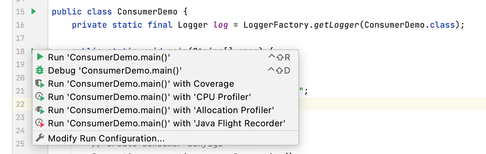

Complete Kafka Consumer with Java
=================================

Learn how to develop a Kafka consumer in Java

* * *

In IntelliJ IDEA, open the project created in the last section.

> [!TIP]
> **Start Kafka!**
>
> Before running your Java consumer application, make sure that you have [started Kafka](/kafka/starting-kafka/).

* * *

How to Create a Kafka Consumer in Java?
---------------------------------------

[](#How-to-Create-a-Kafka-Consumer-in-Java?-0)

These are the steps to create a Kafka consumer:

1.  Create a Java Class `ConsumerDemo.java`
    
2.  Create the consumer properties
    
3.  Create a consumer
    
4.  Subscribe the consumer to a specific topic
    
5.  Create a Poll loop to receive data
    

### Create a Java Class ConsumerDemo.java

[](#Create-a-Java-Class-ConsumerDemo.java-0)

Create it as `io.conduktor.demos.kafka.ConsumerDemo` and insert the following content:

```
package io.conduktor.demos.kafka;

import org.slf4j.Logger;
import org.slf4j.LoggerFactory;

public class ConsumerDemo {
    private static final Logger log = LoggerFactory.getLogger(ProducerDemo.class);

    public static void main(String[] args) {
        log.info("I am a Kafka Consumer");
    }
}
```

### Create Kafka Consumer Properties

[](#Create-Kafka-Consumer-Properties-1)

Similar to the producer properties, Apache Kafka offers various different properties for creating a consumer as well. To know about each consumer property, visit [https://kafka.apache.org/documentation/#consumerconfigs](https://kafka.apache.org/documentation/#consumerconfigs) **Apache Kafka > Documentation > Configuration > Consumer Configs.**


Here, we will list the required properties of a consumer:

*   **key.deserializer:** It is a Deserializer class for the key, which is used to implement the `org.apache.kafka.common.serialization.Deserializer` interface.
    
*   **value.deserializer:** A Deserializer class for value which implements the `org.apache.kafka.common.serialization.Deserializer` interface.
    
*   **bootstrap.servers:** It is a list of host and port pairs that are used to establish an initial connection with the Kafka cluster. It does not contain a full set of servers that a client requires. Only the servers which are required for bootstrapping are required.
    
*   **group.id:** It is a unique string that identifies the consumer of a consumer group.
    
*   **auto.offset.reset:** This property is required when no initial offset is present or if the current offset does not exist anymore on the server. There are the following values used to reset the offset values:
    
    *   **earliest:** This offset variable automatically reset the value to its earliest offset.
        
    *   **latest:** This offset variable reset the offset value to its latest offset.
        
    *   **none:** If no previous offset is found for the previous group, it throws an exception to the consumer.
        

These are some essential properties that are required to implement a consumer. Let's implement using IntelliJ IDEA.

```
        String bootstrapServers = "127.0.0.1:9092";
        String groupId = "my-fourth-application";
        String topic = "demo_java";

        // create consumer configs
        Properties properties = new Properties();
        properties.setProperty(ConsumerConfig.BOOTSTRAP_SERVERS_CONFIG, bootstrapServers);
        properties.setProperty(ConsumerConfig.KEY_DESERIALIZER_CLASS_CONFIG, StringDeserializer.class.getName());
        properties.setProperty(ConsumerConfig.VALUE_DESERIALIZER_CLASS_CONFIG, StringDeserializer.class.getName());
        properties.setProperty(ConsumerConfig.GROUP_ID_CONFIG, groupId);
        properties.setProperty(ConsumerConfig.AUTO_OFFSET_RESET_CONFIG, "earliest");
```

> [!TIP]
> **Auto Offset Reset**
>
> Auto Offset Reset is set to "earliest", which means on the first run of the application we will be reading all historical data in our topic.

### Create the Kafka Consumer

[](#Create-the-Kafka-Consumer-2)

Create an object of `KafkaConsumer` leveraging our properties, as shown below:

```
        // create consumer
        KafkaConsumer<String, String> consumer = new KafkaConsumer<>(properties);
```

### Subscribe the consumer to a specific topic

[](#Subscribe-the-consumer-to-a-specific-topic-3)

To read the messages from a topic, we need to connect the consumer to the specified topic. Here, we use `Arrays.asList(),`as it allows our consumer to subscribe to multiple topics.

Below code shows the implementation of subscription of the consumer to one topic:

```
        // subscribe consumer to our topic(s)
        consumer.subscribe(Arrays.asList(topic));
```

### Poll for some new data

[](#Poll-for-some-new-data-4)

The consumer reads data from Kafka through the polling method. The `poll` method returns the data that hasn't been fetched yet by the consumer subscribed to the partitions. The duration of the poll call for example `.poll(Duration.ofMillis(100))` is the amount of time to block on this call before returning an empty list in case no data was returned (also called long polling)

```
        // poll for new data
        while(true){
            ConsumerRecords<String, String> records =
                    consumer.poll(Duration.ofMillis(100));

            for (ConsumerRecord<String, String> record : records){
                log.info("Key: " + record.key() + ", Value: " + record.value());
                log.info("Partition: " + record.partition() + ", Offset:" + record.offset());
            }
        }
```

### Run your Java Kafka Consumer application

[](#Run-your-Java-Kafka-Consumer-application-5)

Run the Java application.



It will run displaying messages from the topic, `demo_java`, created in the last section.

```
...
[main] INFO io.conduktor.demos.kafka.ConsumerDemo - Key: null, Value: hello world 4
[main] INFO io.conduktor.demos.kafka.ConsumerDemo - Partition: 2, Offset:13
[main] INFO io.conduktor.demos.kafka.ConsumerDemo - Key: null, Value: hello world 6
[main] INFO io.conduktor.demos.kafka.ConsumerDemo - Partition: 2, Offset:14
[main] INFO io.conduktor.demos.kafka.ConsumerDemo - Key: null, Value: hello world 8
[main] INFO io.conduktor.demos.kafka.ConsumerDemo - Partition: 2, Offset:15
[main] INFO io.conduktor.demos.kafka.ConsumerDemo - Key: id_2, Value: hello world 2
[main] INFO io.conduktor.demos.kafka.ConsumerDemo - Partition: 2, Offset:16
[main] INFO io.conduktor.demos.kafka.ConsumerDemo - Key: id_4, Value: hello world 4
[main] INFO io.conduktor.demos.kafka.ConsumerDemo - Partition: 2, Offset:17
[main] INFO io.conduktor.demos.kafka.ConsumerDemo - Key: id_5, Value: hello world 5
...
```

Consumer application runs in an infinite loop, use IntelliJ stop button to stop your application.

* * *

### Java Consumers inside a Consumer Group

[](#Java-Consumers-inside-a-Consumer-Group-6)

We have seen that consumers [can share reads in a Consumer Group](/kafka/kafka-consumer-groups-and-consumer-offsets/) in order to scale. We can achieve this [using the CLI](/kafka/kafka-consumers-in-group-cli-tutorial/), and of course using Java (right below)

### Read messages from the beginning

[](#Read-messages-from-the-beginning-7)

In the last section, we assigned a group id of `my-fourth-application` to the consumer.

Stop the consumer application, and re-run it. You will notice there are no messages displayed in the console. This is due to the fact that Kafka keeps track of consumer reads (consumer groups offsets) and therefore the consumer will not encounter the same messages twice.

If you change the group id to `my-fifth-application` as shown below.

```
String bootstrapServers = "127.0.0.1:9092";
String groupId = "my-fifth-application";
String topic = "demo_java";
```

Re-start the application. It will display all the messages in the topic `demo_java` from the beginning.


### Partition Rebalance

[](#Partition-Rebalance-8)

Moving partition ownership from one consumer to another is called a rebalance. Rebalances are important because they provide the consumer group with high availability and scalability.

Currently, we only have one consumer in our group, and therefore that consumer reads from all the topic partitions.

**To see rebalances in action, launch another consumer by running the same consumer application.**

Make sure you have configured to run multiple instances of the application in project setting:


Then, edit your configuration to allow for Multiple Instances


Then apply and okay to save your changes.

Now you can run your consumer multiples times.

**The first consumer displays the following information**:

```
[main] INFO ...  Discovered group coordinator 127.0.0.1:9094 (id: 2147483644 rack: null)
[main] INFO ...  (Re-)joining group
[main] INFO ...  Request joining group due to: need to re-join with the given member-id
[main] INFO ...  (Re-)joining group
[main] INFO ...  Successfully joined group with generation Generation{generationId=3, memberId='consumer-my-fifth-application-1-c40fcb55-9893-4b03-a2dd-6acfe08b0c8d', protocol='range'}
[main] INFO ...  Finished assignment for group at generation 3: {consumer-my-fifth-application-1-c40fcb55-9893-4b03-a2dd-6acfe08b0c8d=Assignment(partitions=[demo_java-0, demo_java-1, demo_java-2])}
[main] INFO ...  Successfully synced group in generation Generation{generationId=3, memberId='consumer-my-fifth-application-1-c40fcb55-9893-4b03-a2dd-6acfe08b0c8d', protocol='range'}
[main] INFO ...  Notifying assignor about the new Assignment(partitions=[demo_java-0, demo_java-1, demo_java-2])
[main] INFO ...  Adding newly assigned partitions: demo_java-0, demo_java-1, demo_java-2
[main] INFO ...  Setting offset for partition demo_java-0 to the committed offset FetchPosition{offset=8, offsetEpoch=Optional[0], currentLeader=LeaderAndEpoch{leader=Optional[127.0.0.1:9092 (id: 1 rack: null)], epoch=0}}
[main] INFO ...  Setting offset for partition demo_java-1 to the committed offset FetchPosition{offset=8, offsetEpoch=Optional[0], currentLeader=LeaderAndEpoch{leader=Optional[127.0.0.1:9093 (id: 2 rack: null)], epoch=0}}
[main] INFO ...  Setting offset for partition demo_java-2 to the committed offset FetchPosition{offset=26, offsetEpoch=Optional[0], currentLeader=LeaderAndEpoch{leader=Optional[127.0.0.1:9094 (id: 3 rack: null)], epoch=0}}
```

As we see, the consumer is reading the latest consumer offsets and is assigned to the three partitions in the topic demo java `Assignment(partitions=[demo_java-0, demo_java-1, demo_java-2])`

Launch a second consumer using the same process defined as above (do not stop the previous one) and notice the rebalance:

**Second Consumer Log**

```
[main] INFO ... (Re-)joining group
[main] INFO ... Successfully joined group with generation Generation{generationId=4, memberId='consumer-my-fifth-application-1-beb305ca-524d-466c-b8ce-9ef675382bc3', protocol='range'}
[main] INFO ... Successfully synced group in generation Generation{generationId=4, memberId='consumer-my-fifth-application-1-beb305ca-524d-466c-b8ce-9ef675382bc3', protocol='range'}
[main] INFO ... Notifying assignor about the new Assignment(partitions=[demo_java-0, demo_java-1])
[main] INFO ... Adding newly assigned partitions: demo_java-0, demo_java-1
[main] INFO ... Setting offset for partition demo_java-0 to the committed offset FetchPosition{offset=8, offsetEpoch=Optional[0], currentLeader=LeaderAndEpoch{leader=Optional[127.0.0.1:9092 (id: 1 rack: null)], epoch=0}}
[main] INFO ... Setting offset for partition demo_java-1 to the committed offset FetchPosition{offset=8, offsetEpoch=Optional[0], currentLeader=LeaderAndEpoch{leader=Optional[127.0.0.1:9093 (id: 2 rack: null)], epoch=0}}
```

As you can see partitions `demo_java-0, demo_java-1` have been assigned to the consumer

**First Consumer Log**

```
[main] INFO ... Request joining group due to: group is already rebalancing
[main] INFO ... Revoke previously assigned partitions demo_java-0, demo_java-1, demo_java-2
[main] INFO ... (Re-)joining group
[main] INFO ... Successfully joined group with generation Generation{generationId=4, memberId='consumer-my-fifth-application-1-c40fcb55-9893-4b03-a2dd-6acfe08b0c8d', protocol='range'}
[main] INFO ... Finished assignment for group at generation 4: {consumer-my-fifth-application-1-c40fcb55-9893-4b03-a2dd-6acfe08b0c8d=Assignment(partitions=[demo_java-2]), consumer-my-fifth-application-1-beb305ca-524d-466c-b8ce-9ef675382bc3=Assignment(partitions=[demo_java-0, demo_java-1])}
[main] INFO ... Successfully synced group in generation Generation{generationId=4, memberId='consumer-my-fifth-application-1-c40fcb55-9893-4b03-a2dd-6acfe08b0c8d', protocol='range'}
[main] INFO ... Notifying assignor about the new Assignment(partitions=[demo_java-2])
[main] INFO ... Adding newly assigned partitions: demo_java-2
[main] INFO ... Setting offset for partition demo_java-2 to the committed offset FetchPosition{offset=26, offsetEpoch=Optional[0], currentLeader=LeaderAndEpoch{leader=Optional[127.0.0.1:9094 (id: 3 rack: null)], epoch=0}}
```

As you can see, the partitions assignment was revoked and after the rebalance, only `demo_java-2` was assigned to this consumer .

Produce a few messages on the topic using the Kafka producer application that we developed in the last section. The two consumer applications will receive messages from their respective partitions only.

* * *

Automatic Offset Committing Strategy
------------------------------------

[](#Automatic-Offset-Committing-Strategy-1)

Using the Kafka Consumer Java API, offsets are committed regularly and automatically in order to enable at-least-once reading scenarios.

You can get a refresher on [Consumer Offsets here](/kafka/kafka-consumer-groups-and-consumer-offsets/).

By default, the property `enable.auto.commit=true` and therefore offsets are committed automatically with a frequency controlled by the config `auto.commit.interval.ms`.

The process of committing the offsets happens when the `.poll()` function is called and the time between two calls to `.poll()` is greater than the setting `auto.commit.interval.ms` (5 seconds by default).

This means that to be in an "at-least-once" processing use case (the most desirable one), you need to ensure all the messages in your consumer code are successfully processed before performing another `.poll()` call (which is the case in the sample code defined above). If this is not the case, then offsets could be committed before the messages are actually processed, therefore resulting in an "at-most once" processing pattern, possibly resulting in message skipping (which is undesirable).

In that (rare) case, you must disable `enable.auto.commit`, and most likely most processing to a separate thread, and then from time to time call `.commitSync()` or `.commitAsync()`with the correct offsets manually.

This complicated use case is discussed in the [Kafka Consumer Documentation](https://kafka.apache.org/30/javadoc/org/apache/kafka/clients/consumer/KafkaConsumer.html) under the section "Automatic Offset Committing".


* * *

Graceful Shutdown of Consumer
-----------------------------

[](#Graceful-Shutdown-of-Consumer-2)

Currently our consumer is running an infinite loop with `while(true)` but we can catch an Exception that happens when our consumer is shutting down.

For this, we need to call `consumer.wakeup()` which will trigger a `WakeupException` next time the `.poll()` function is called.

The `WakeupException` itself does not need to be handled, but then in a `finally{}` block we can call `consumer.close()` which will take care of:

*   committing the offsets if needed
    
*   close the connection to Kafka
    

In order to call `consumer.wakeup()` we need to use a `ShutdownHook.` That ShutdownHook needs to be linked to the main thread in order to wait for all threads to complete before shutting down the program.

The complete code is seen below:

```
package io.conduktor.demos.kafka;

import org.apache.kafka.clients.consumer.ConsumerConfig;
import org.apache.kafka.clients.consumer.ConsumerRecord;
import org.apache.kafka.clients.consumer.ConsumerRecords;
import org.apache.kafka.clients.consumer.KafkaConsumer;
import org.apache.kafka.common.errors.WakeupException;
import org.apache.kafka.common.serialization.StringDeserializer;
import org.slf4j.Logger;
import org.slf4j.LoggerFactory;

import java.time.Duration;
import java.util.Arrays;
import java.util.Properties;

public class ConsumerDemo {
    private static final Logger log = LoggerFactory.getLogger(ConsumerDemo.class);

    public static void main(String[] args) {
        log.info("I am a Kafka Consumer");

        String bootstrapServers = "127.0.0.1:9092";
        String groupId = "my-fifth-application";
        String topic = "demo_java";

        // create consumer configs
        Properties properties = new Properties();
        properties.setProperty(ConsumerConfig.BOOTSTRAP_SERVERS_CONFIG, bootstrapServers);
        properties.setProperty(ConsumerConfig.KEY_DESERIALIZER_CLASS_CONFIG, StringDeserializer.class.getName());
        properties.setProperty(ConsumerConfig.VALUE_DESERIALIZER_CLASS_CONFIG, StringDeserializer.class.getName());
        properties.setProperty(ConsumerConfig.GROUP_ID_CONFIG, groupId);
        properties.setProperty(ConsumerConfig.AUTO_OFFSET_RESET_CONFIG, "earliest");

        // create consumer
        KafkaConsumer<String, String> consumer = new KafkaConsumer<>(properties);

        // get a reference to the current thread
        final Thread mainThread = Thread.currentThread();

        // adding the shutdown hook
        Runtime.getRuntime().addShutdownHook(new Thread() {
            public void run() {
                log.info("Detected a shutdown, let's exit by calling consumer.wakeup()...");
                consumer.wakeup();

                // join the main thread to allow the execution of the code in the main thread
                try {
                    mainThread.join();
                } catch (InterruptedException e) {
                    e.printStackTrace();
                }
            }
        });

        try {

            // subscribe consumer to our topic(s)
            consumer.subscribe(Arrays.asList(topic));

            // poll for new data
            while (true) {
                ConsumerRecords<String, String> records =
                        consumer.poll(Duration.ofMillis(100));

                for (ConsumerRecord<String, String> record : records) {
                    log.info("Key: " + record.key() + ", Value: " + record.value());
                    log.info("Partition: " + record.partition() + ", Offset:" + record.offset());
                }
            }

        } catch (WakeupException e) {
            log.info("Wake up exception!");
            // we ignore this as this is an expected exception when closing a consumer
        } catch (Exception e) {
            log.error("Unexpected exception", e);
        } finally {
            consumer.close(); // this will also commit the offsets if need be.
            log.info("The consumer is now gracefully closed.");
        }

    }
}
```

The important part to look at is to have a try around our `while` loop and catch for the `WakeupException` that we will trigger from within the loop.

### Output of the graceful shutdown

[](#Output-of-the-graceful-shutdown-9)

All in all, the output with a graceful shutdown is the following:

```
[Thread-0] INFO io.conduktor.demos.kafka.ConsumerDemo - Detected a shutdown, let's exit by calling consumer.wakeup()...
[main] INFO io.conduktor.demos.kafka.ConsumerDemo - Wake up exception!
[main] INFO org.apache.kafka.clients.consumer.internals.ConsumerCoordinator - [Consumer clientId=consumer-my-fifth-application-1, groupId=my-fifth-application] Revoke previously assigned partitions demo_java-0, demo_java-1, demo_java-2
[main] INFO org.apache.kafka.clients.consumer.internals.ConsumerCoordinator - [Consumer clientId=consumer-my-fifth-application-1, groupId=my-fifth-application] Member consumer-my-fifth-application-1-4498399b-0c5d-45a9-958f-8b31f124a3d9 sending LeaveGroup request to coordinator 127.0.0.1:9094 (id: 2147483644 rack: null) due to the consumer is being closed
[main] INFO org.apache.kafka.clients.consumer.internals.ConsumerCoordinator - [Consumer clientId=consumer-my-fifth-application-1, groupId=my-fifth-application] Resetting generation due to: consumer pro-actively leaving the group
[main] INFO org.apache.kafka.clients.consumer.internals.ConsumerCoordinator - [Consumer clientId=consumer-my-fifth-application-1, groupId=my-fifth-application] Request joining group due to: consumer pro-actively leaving the group
[main] INFO org.apache.kafka.common.metrics.Metrics - Metrics scheduler closed
[main] INFO org.apache.kafka.common.metrics.Metrics - Closing reporter org.apache.kafka.common.metrics.JmxReporter
[main] INFO org.apache.kafka.common.metrics.Metrics - Metrics reporters closed
[main] INFO org.apache.kafka.common.utils.AppInfoParser - App info kafka.consumer for consumer-my-fifth-application-1 unregistered
[main] INFO io.conduktor.demos.kafka.ConsumerDemo - The consumer is now gracefully closed.
```