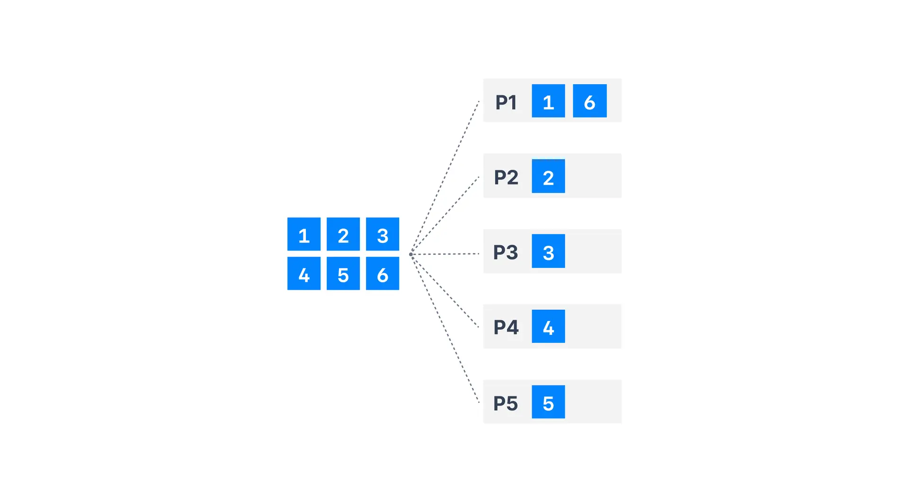
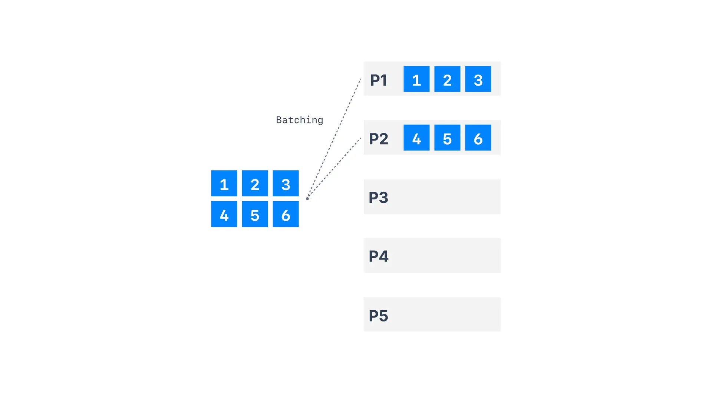
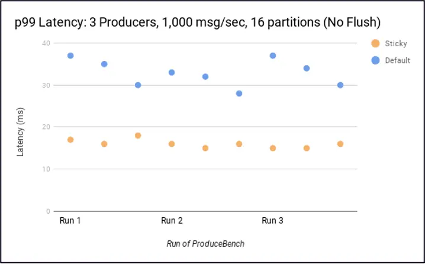
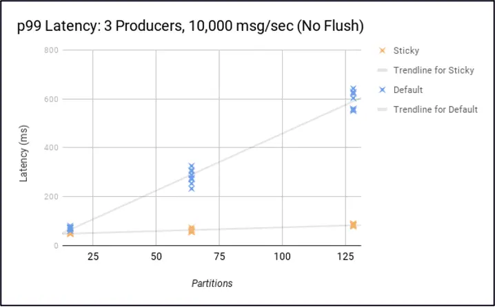

Producer Default Partitioner & Sticky Partitioner
=================================================

A partitioner is the process that will determine to which partition a specific message will be assigned to.

* * *

A partitioner is the process that will determine to which partition a specific message will be assigned to.

Partitioner when key!=null
--------------------------

[](#Partitioner-when-key!=null-0)

Key Hashing is the process of determining the mapping of a key to a partition In the default Kafka partitioner, the keys are hashed using the murmur2 algorithm

```
targetPartition = Math.abs(Utils.murmur2(keyBytes)) % (numPartitions - 1)
```

This means that same key will go to the same partition and adding partitions to a topic will completely alter the formula. It is most likely preferred to not override the behavior of the partitioner, but it is possible to do so using `partitioner.class`.


* * *

Partitioner when key=null
-------------------------

[](#Partitioner-when-key=null-1)

When `key=null`, the producer has a default partitioner that varies:

*   **Round Robin**: for Kafka 2.3 and below
    
*   **Sticky Partitioner**: for Kafka 2.4 and above
    

Sticky Partitioner improves the performance of the producer especially with high throughput.

Round Robin Partitioner (Kafka ≤ v2.3)
--------------------------------------

[](#Round-Robin-Partitioner-(Kafka-≤-v2.3)-2)

With Kafka ≤ v2.3, when there’s no partition and no key specified, the default partitioner sends data in a round-robin fashion. This results in more batches (one batch per partition) and smaller batches (imagine with 100 partitions). And this is a problem because smaller batches lead to more requests as well as higher latency.



Round Robin Partitioner

Sticky Partitioner (Kafka ≥ 2.4)
--------------------------------

[](#Sticky-Partitioner-(Kafka-≥-2.4)-3)

It is a performance goal to have all the records sent to a single partition and not multiple partitions to improve batching.

The producer sticky partitioner will:

*   “stick” to a partition until the batch is full or `linger.ms` has elapsed
    
*   After sending the batch, change the partition that is "sticky"
    

This will lead to larger batches and reduced latency (because we have larger requests, and the `batch.size` is more likely to be reached). Over time, the records are still spread evenly across partitions, so the balance of the cluster is not affected.



Overall, there are some substantial [performance improvements](https://cwiki.apache.org/confluence/display/KAFKA/KIP-480%3A+Sticky+Partitioner) by using the Sticky Partitioner.

The latency is smaller:



And the latency in noticeably lower the more partitions you have.



---
Next: [Other Advanced Kafka Producer Configurations](https://github.com/AbdoMusk/Apache-Kafka/blob/main/5-%20Kafka%20Advanced%20Concepts/2-%20Kafka%20Producers%20Advanced/7-%20Other%20Advanced%20Kafka%20Producer%20Configurations.md)