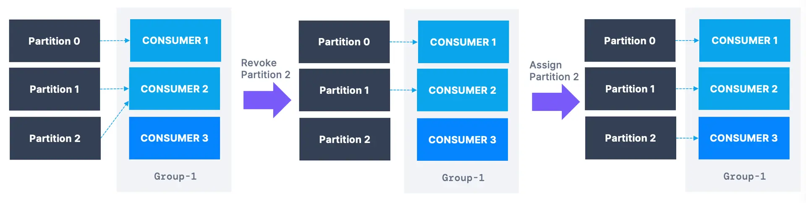

Consumer Incremental Rebalance & Static Group Membership
========================================================

What are Kafka Consumer Rebalances?

* * *

When partition assignments are moving between your consumer, we are dealing with consumer rebalances.

Rebalances can happen in the following conditions:

*   a consumer leaves the group
    
*   a consumer joins a group
    
*   partitions are added to a topic
    

You can have control over the rebalance strategy, as we will see on this page.

Rebalance after a consumer joins a group

Consumer Eager Rebalancing
--------------------------

By default, consumers perform eager rebalancing, which means that all consumers stop consuming from Apache Kafka and give up the membership of their partitions.

During this period of time, the entire consumer group stops processing, this is also called a "stop the world" event.

They will rejoin the consumer group and get a new partition assignment, but don't necessarily "get back" the partitions that were previously assigned to them.

Consumer Cooperative Rebalance (Incremental Rebalance)
------------------------------------------------------

-1)

In this mode, only a subset of partitions is moved from one consumer to another. Other Kafka consumers that are not concerned by the rebalance can keep on processing data without interruptions. Your whole consumer group can go through several rebalances until finding a stable assignment, hence the name incremental rebalance.

### How to use the cooperative rebalance?

**Kafka Consumer:** `**partition.assignment.strategy**`

You can set the configuration to several values, the last one being the incremental cooperative rebalancing

*   `RangeAssignor`: assign partitions on a per-topic basis (can lead to imbalance)
    
*   `RoundRobin`: assign partitions across all topics in a round-robin fashion, optimal balance
    
*   `StickyAssignor`: balanced like RoundRobin, and then minimizes partition movements when consumers join/leave the group in order to minimize movements
    
*   `**CooperativeStickyAssignor**`**: rebalance strategy is identical to StickyAssignor but supports cooperative rebalances and therefore consumers can keep on consuming from the topic**
    

The default assignor is \[`RangeAssignor, CooperativeStickyAssignor`\], which will use the `RangeAssignor` by default, but allows upgrading to the `CooperativeStickyAssignor` with just a single rolling bounce that removes the `RangeAssignor` from the list.

**Kafka Connect:**

Already implemented (enabled by default)

**Kafka Streams:**

Turned on by default using `StreamsPartitionAssignor`

Consumer Static Group Membership
--------------------------------

By default, when a consumer leaves a group, its partitions are revoked and re-assigned. If the consumer joins back, it will have a new `member.id` and new partitions assigned based on the mechanisms described previously on this page.

If you specify `group.instance.id` it makes the consumer a static member: upon leaving, the consumer has up to `session.timeout.ms` to join back and get back its partitions (else they will be re-assigned), without triggering a rebalance.

This is helpful when consumers maintain local state and cache (to avoid re-building the cache) and when doing rolling restarts without wanting to trigger a rebalance.

