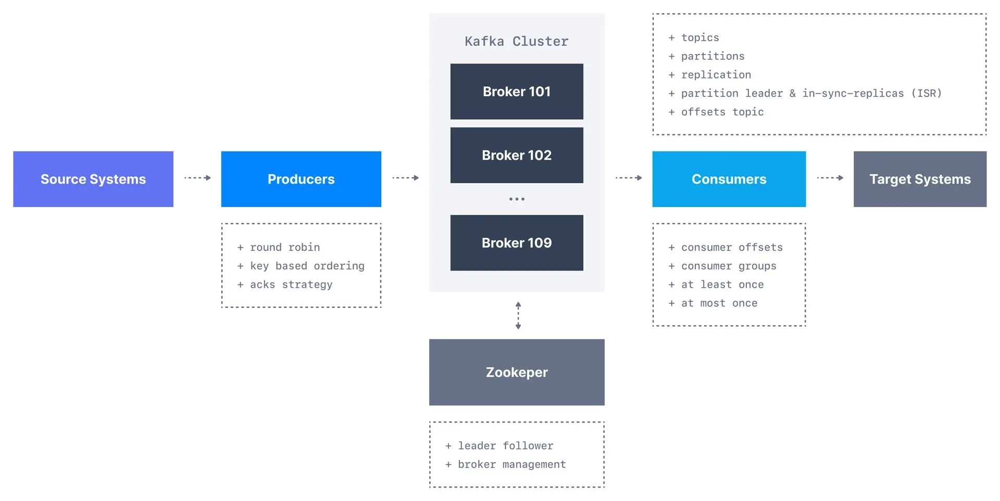

Kafka Fundamentals
==================

Learn how Kafka works, get a strong understanding of the different components

* * *

We have learned about data event streaming, Apache Kafka and its various components at a high level.

Now, we will dive in and learn how each part of Apache Kafka works.

Apache Kafka Components

In this section, we will learn all of the fundamentals and understand the various Apache Kafka components such as:

*   **Kafka Topics**
    
*   **Kafka Producers**
    
*   **Kafka Consumers**
    
*   **Kafka Consumer Groups and Consumer Offsets**
    
*   **Kafka Brokers**
    
*   **Kafka Topic Replication**
    
*   **Zookeeper**
    
*   **KRaft Mode**
    

This content is intended for users who want to understand and use Apache Kafka properly.