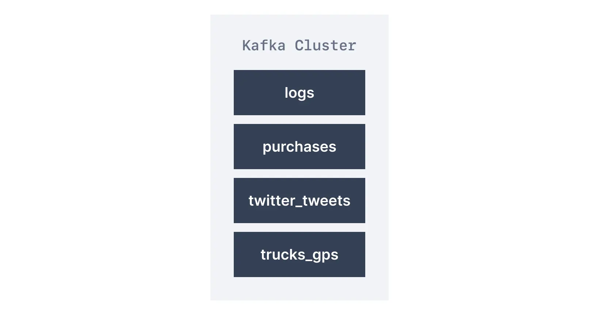

Beginner

Advanced

What is a Kafka Topic?
----------------------

Similar to how databases have tables to organize and segment datasets, Kafka uses the concept of topics to organize related messages.

A topic is identified by its name. For example, we may have a topic called **logs** that may contain log messages from our application, and another topic called **purchases** that may contain purchase data from our application as it happens.

Kafka topics can contain any kind of message in any format, and the sequence of all these messages is called a data stream.

> [!WARNING]("Kafka Topics - Warning")
> Unlike database tables, Kafka topics are not query-able. Instead, we have to create Kafka producers to send data to the topic and Kafka consumers to read the data from the topic in order.

Data in Kafka topics is deleted after one week by default (also called the default message retention period), and this value is configurable. This mechanism of deleting old data ensures a Kafka cluster does not run out of disk space by recycling topics over time.

What are Kafka Partitions?
--------------------------

Topics are broken down into a number of partitions. A single topic may have more than one partition, it is common to see topics with 100 partitions.

The number of partitions of a topic is specified at the time of topic creation. Partitions are numbered starting from `0` to `N-1`, where `N` is the number of partitions. The figure below shows a topic with three partitions, with messages being appended to the end of each one.

Topic Partitions

The offset is an integer value that Kafka adds to each message as it is written into a partition. Each message in a given partition has a unique offset.

Kafka Topics

Kafka topics are **immutable**: once data is written to a partition, it cannot be changed

Kafka Topic example
-------------------

Using Apache Kafka for Fleet Tracking

A traffic company wants to track its fleet of trucks. Each truck is fitted with a GPS locator that reports its position to Kafka. We can create a topic named - **trucks\_gps** to which the trucks publish their positions. Each truck may send a message to Kafka every 20 seconds, each message will contain the truck ID and the truck position (latitude and longitude). The topic may be split into a suitable number of partitions, say 10. There may be different consumers of the topic. For example, an application that displays truck locations on a dashboard or another application that sends notifications if an event of interest occurs.

What are Kafka Offsets?
-----------------------

Apache Kafka offsets represent the position of a message within a Kafka Partition. Offset numbering for every partition starts at `0` and is incremented for each message sent to a specific Kafka partition. This means that Kafka offsets only have a meaning for a specific partition, e.g., offset 3 in partition 0 doesn’t represent the same data as offset 3 in partition 1.

Kafka Offset Ordering

If a topic has more than one partition, Kafka guarantees the order of messages within a partition, but there is no ordering of messages across partitions.

Even though we know that messages in Kafka topics are deleted over time (as seen above), the offsets are not re-used. They continually are incremented in a never-ending sequence.